# Arquitectura del Sistema Mercado Trueque

## Tabla de Contenidos

1. [Introducción](#introducción)
2. [Visión General](#visión-general)
3. [Diagrama de Arquitectura Hexagonal](#1-diagrama-de-arquitectura-hexagonal)
4. [Flujo de Datos End-to-End](#2-flujo-de-datos-end-to-end)
5. [Componentes del Backend](#3-componentes-del-backend)
6. [Sistema de Estados del Trueque](#4-sistema-de-estados-del-trueque)
7. [Modelo de Dominio](#5-modelo-de-dominio)
8. [Autenticación y Autorización](#6-autenticación-y-autorización)
9. [Arquitectura del Frontend](#7-arquitectura-del-frontend)
10. [Sistema de Notificaciones](#8-sistema-de-notificaciones)
11. [Patrones de Diseño](#9-patrones-de-diseño)
12. [Comparativa Backend/Frontend](#10-comparativa-backendfrontend)
13. [Decisiones Arquitectónicas](#decisiones-arquitectónicas)
14. [Referencias](#referencias)

---

## Introducción

**Mercado Trueque** es una plataforma web para intercambio de productos entre usuarios. El sistema implementa una **Arquitectura Limpia (Clean Architecture)** con Domain-Driven Design (DDD), permitiendo alta cohesión, bajo acoplamiento y facilidad de mantenimiento.

### Stack Tecnológico

**Backend:**
- NestJS (Framework)
- Prisma ORM
- PostgreSQL (Base de datos)
- JWT + Passport (Autenticación)
- TypeScript

**Frontend:**
- React 18
- Vite (Build tool)
- React Router v6
- Axios (HTTP client)
- Context API (Estado global)

---

## Visión General

El sistema está dividido en dos aplicaciones principales:

1. **Backend (server/)**: API RESTful construida con NestJS siguiendo arquitectura hexagonal
2. **Frontend (client/)**: SPA construida con React y Context API

La comunicación entre ambas se realiza mediante HTTP REST con autenticación JWT.

---

## 1. Diagrama de Arquitectura Limpia

La arquitectura del backend sigue el patrón de **Arquitectura Limpia (Clean Architecture)** con 4 capas bien definidas:

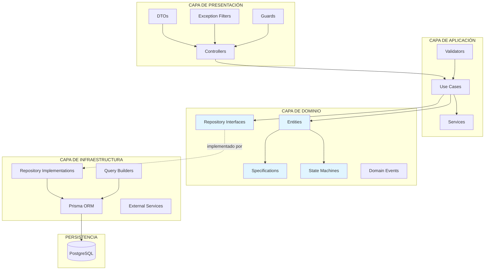
```mermaid
graph TB
    subgraph "CAPA DE PRESENTACIÓN"
        A[Controllers]
        B[DTOs]
        C[Exception Filters]
        D[Guards]
    end

    subgraph "CAPA DE APLICACIÓN"
        E[Use Cases]
        F[Validators]
        G[Services]
    end

    subgraph "CAPA DE DOMINIO"
        H[Entities]
        I[Repository Interfaces]
        J[Specifications]
        K[State Machines]
        L[Domain Events]
    end

    subgraph "CAPA DE INFRAESTRUCTURA"
        M[Repository Implementations]
        N[Prisma ORM]
        O[Query Builders]
        P[External Services]
    end

    subgraph "PERSISTENCIA"
        Q[(PostgreSQL)]
    end

    A --> E
    B --> A
    C --> A
    D --> A

    E --> H
    E --> I
    E --> G
    F --> E

    I -.implementado por.-> M
    M --> N
    N --> Q
    O --> N

    H --> K
    H --> J

    style H fill:#e1f5ff
    style I fill:#e1f5ff
    style J fill:#e1f5ff
    style K fill:#e1f5ff
```

### Descripción de Capas

**PRESENTATION (Presentación):**
- **Responsabilidad**: Punto de entrada HTTP, validación de requests, serialización de responses
- **Componentes**: Controllers, DTOs, Exception Filters, Guards
- **Archivos**: `server/src/presentation/controllers/*.controller.ts`

**APPLICATION (Aplicación):**
- **Responsabilidad**: Lógica de casos de uso, orquestación de operaciones
- **Componentes**: Use Cases, Validators, Application Services
- **Archivos**: `server/src/application/use-cases/*.use-case.ts`

**DOMAIN (Dominio):**
- **Responsabilidad**: Reglas de negocio, entidades, interfaces de repositorio
- **Componentes**: Entities, Repository Interfaces, Specifications, State Machines
- **Archivos**: `server/src/domain/entities/*.entity.ts`, `server/src/domain/repositories/*.repository.ts`

**INFRASTRUCTURE (Infraestructura):**
- **Responsabilidad**: Implementación de persistencia, integración con servicios externos
- **Componentes**: Repository Implementations, Prisma Client, Query Builders
- **Archivos**: `server/src/infrastructure/repositories/*.repository.impl.ts`

---

## 2. Flujo de Datos End-to-End

Este diagrama muestra el flujo completo de una petición desde el frontend hasta la respuesta:

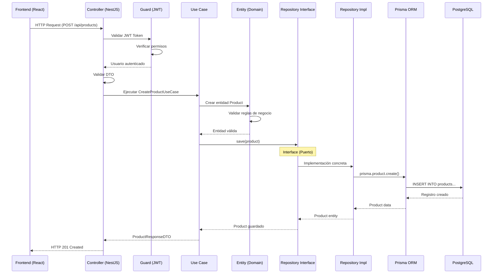
```mermaid
sequenceDiagram
    participant F as Frontend (React)
    participant C as Controller (NestJS)
    participant G as Guard (JWT)
    participant UC as Use Case
    participant E as Entity (Domain)
    participant RI as Repository Interface
    participant RImpl as Repository Impl
    participant P as Prisma ORM
    participant DB as PostgreSQL

    F->>C: HTTP Request (POST /api/products)
    C->>G: Validar JWT Token
    G->>G: Verificar permisos
    G-->>C: Usuario autenticado

    C->>C: Validar DTO
    C->>UC: Ejecutar CreateProductUseCase

    UC->>E: Crear entidad Product
    E->>E: Validar reglas de negocio
    E-->>UC: Entidad válida

    UC->>RI: save(product)
    Note over RI: Interface (Puerto)
    RI->>RImpl: Implementación concreta
    RImpl->>P: prisma.product.create()
    P->>DB: INSERT INTO products...
    DB-->>P: Registro creado
    P-->>RImpl: Product data
    RImpl-->>RI: Product entity
    RI-->>UC: Product guardado

    UC-->>C: ProductResponseDTO
    C-->>F: HTTP 201 Created
```

### Explicación del Flujo

1. **Frontend** envía petición HTTP con JWT token en headers
2. **Controller** recibe la petición
3. **Guard** valida el token JWT y permisos del usuario
4. **Controller** valida el DTO de entrada
5. **Use Case** orquesta la lógica de negocio
6. **Entity** valida reglas de dominio
7. **Repository Interface** define el contrato de persistencia
8. **Repository Implementation** usa Prisma para persistir
9. **Prisma ORM** ejecuta query en PostgreSQL
10. La respuesta fluye en sentido inverso hasta el frontend

---

## 3. Componentes del Backend

### 3.1 Controllers y Use Cases

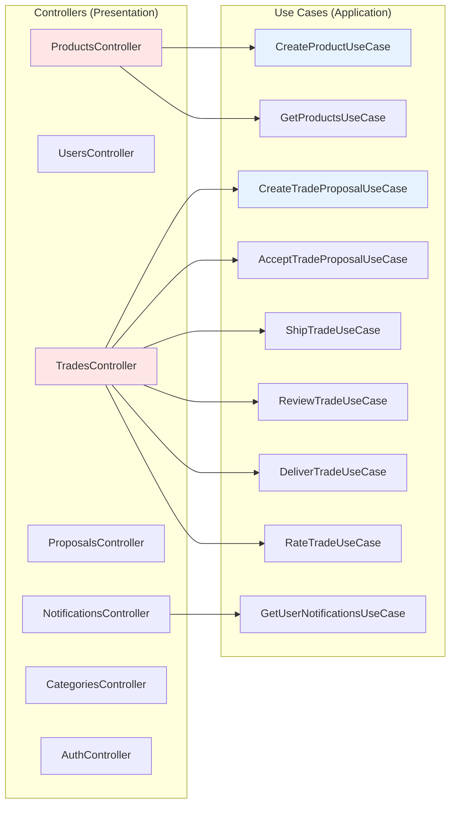
```mermaid
graph LR
    subgraph "Controllers (Presentation)"
        PC[ProductsController]
        UC[UsersController]
        TC[TradesController]
        PRC[ProposalsController]
        NC[NotificationsController]
        CC[CategoriesController]
        AC[AuthController]
    end

    subgraph "Use Cases (Application)"
        CPU[CreateProductUseCase]
        GPU[GetProductsUseCase]
        CTP[CreateTradeProposalUseCase]
        ATP[AcceptTradeProposalUseCase]
        ST[ShipTradeUseCase]
        RT[ReviewTradeUseCase]
        DT[DeliverTradeUseCase]
        RaT[RateTradeUseCase]
        GUN[GetUserNotificationsUseCase]
    end

    PC --> CPU
    PC --> GPU
    TC --> CTP
    TC --> ATP
    TC --> ST
    TC --> RT
    TC --> DT
    TC --> RaT
    NC --> GUN

    style PC fill:#ffe6e6
    style TC fill:#ffe6e6
    style CPU fill:#e6f3ff
    style CTP fill:#e6f3ff
```

### 3.2 Repositories

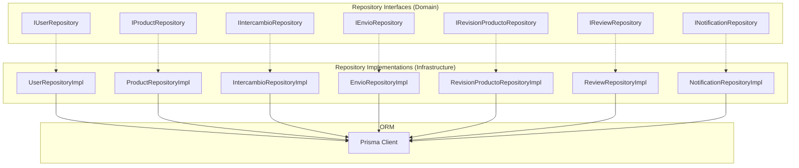
```mermaid
graph TB
    subgraph "Repository Interfaces (Domain)"
        IUR[IUserRepository]
        IPR[IProductRepository]
        ITR[IIntercambioRepository]
        IER[IEnvioRepository]
        IRVR[IRevisionProductoRepository]
        IRR[IReviewRepository]
        INR[INotificationRepository]
    end

    subgraph "Repository Implementations (Infrastructure)"
        URImpl[UserRepositoryImpl]
        PRImpl[ProductRepositoryImpl]
        TRImpl[IntercambioRepositoryImpl]
        ERImpl[EnvioRepositoryImpl]
        RVRImpl[RevisionProductoRepositoryImpl]
        RRImpl[ReviewRepositoryImpl]
        NRImpl[NotificationRepositoryImpl]
    end

    subgraph "ORM"
        Prisma[Prisma Client]
    end

    IUR -.-> URImpl
    IPR -.-> PRImpl
    ITR -.-> TRImpl
    IER -.-> ERImpl
    IRVR -.-> RVRImpl
    IRR -.-> RRImpl
    INR -.-> NRImpl

    URImpl --> Prisma
    PRImpl --> Prisma
    TRImpl --> Prisma
    ERImpl --> Prisma
    RVRImpl --> Prisma
    RRImpl --> Prisma
    NRImpl --> Prisma
```

---

## 4. Sistema de Estados del Trueque

El sistema de trueque implementa una máquina de estados con 6 fases principales:

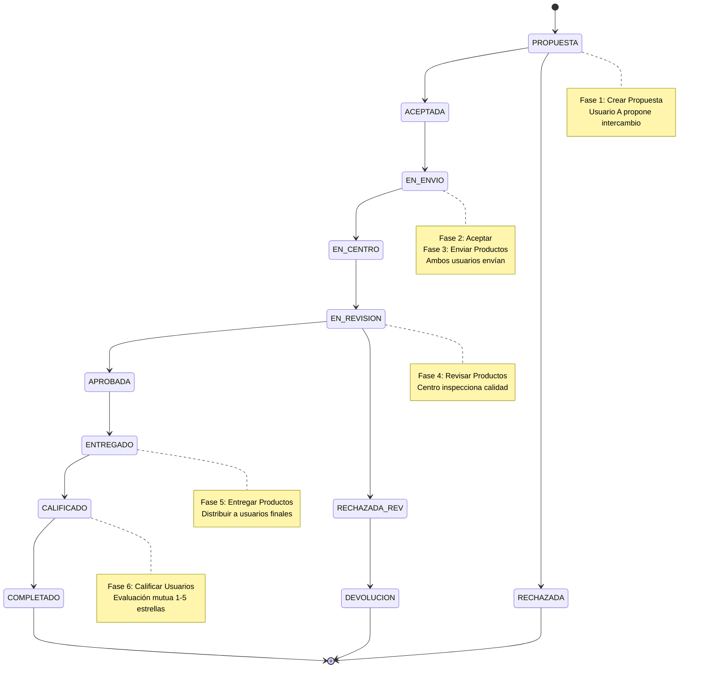
```mermaid
stateDiagram-v2
    [*] --> PROPUESTA

    PROPUESTA --> ACEPTADA
    PROPUESTA --> RECHAZADA

    ACEPTADA --> EN_ENVIO
    EN_ENVIO --> EN_CENTRO
    EN_CENTRO --> EN_REVISION

    EN_REVISION --> APROBADA
    EN_REVISION --> RECHAZADA_REV

    RECHAZADA_REV --> DEVOLUCION
    DEVOLUCION --> [*]

    APROBADA --> ENTREGADO
    ENTREGADO --> CALIFICADO
    CALIFICADO --> COMPLETADO
    COMPLETADO --> [*]

    RECHAZADA --> [*]

    note right of PROPUESTA
        Fase 1: Crear Propuesta
        Usuario A propone intercambio
    end note

    note right of EN_ENVIO
        Fase 2: Aceptar
        Fase 3: Enviar Productos
        Ambos usuarios envían
    end note

    note right of EN_REVISION
        Fase 4: Revisar Productos
        Centro inspecciona calidad
    end note

    note right of ENTREGADO
        Fase 5: Entregar Productos
        Distribuir a usuarios finales
    end note

    note right of CALIFICADO
        Fase 6: Calificar Usuarios
        Evaluación mutua 1-5 estrellas
    end note
```

### Estados de Intercambio (Enum)

```typescript
enum EstadoIntercambio {
  PROPUESTA_CREADA = 'PROPUESTA_CREADA',
  PROPUESTA_ACEPTADA = 'PROPUESTA_ACEPTADA',
  PROPUESTA_RECHAZADA = 'PROPUESTA_RECHAZADA',
  PRODUCTOS_ENVIADOS = 'PRODUCTOS_ENVIADOS',
  EN_CENTRO_DISTRIBUCION = 'EN_CENTRO_DISTRIBUCION',
  PRODUCTOS_REVISADOS = 'PRODUCTOS_REVISADOS',
  REVISION_APROBADA = 'REVISION_APROBADA',
  REVISION_RECHAZADA = 'REVISION_RECHAZADA',
  PRODUCTOS_ENTREGADOS = 'PRODUCTOS_ENTREGADOS',
  USUARIOS_CALIFICADOS = 'USUARIOS_CALIFICADOS',
  COMPLETADO = 'COMPLETADO',
  CANCELADO = 'CANCELADO',
  DEVOLUCION_INICIADA = 'DEVOLUCION_INICIADA'
}
```

### Transiciones Válidas

La entidad `Intercambio` implementa validación de transiciones de estado:

```typescript
// server/src/domain/entities/intercambio.entity.ts
actualizarEstado(nuevoEstado: EstadoIntercambio): void {
  // Validar transición válida según reglas de negocio
  // Lanzar excepción si transición inválida
}
```

---

## 5. Modelo de Dominio

### 5.1 Diagrama de Entidades Principales

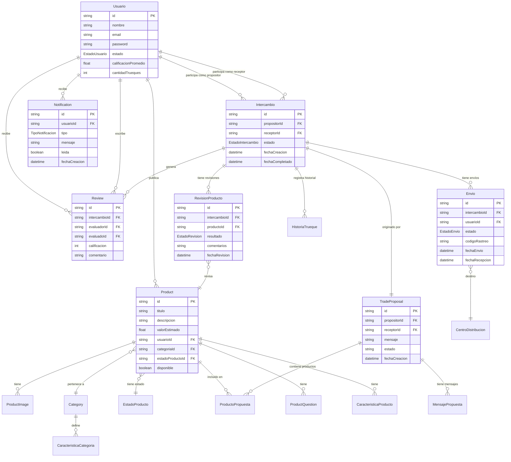
```mermaid
erDiagram
    Usuario ||--o{ Product : "publica"
    Usuario ||--o{ Intercambio : "participa como propositor"
    Usuario ||--o{ Intercambio : "participa como receptor"
    Usuario ||--o{ Review : "recibe"
    Usuario ||--o{ Review : "escribe"
    Usuario ||--o{ Notification : "recibe"

    Product ||--o{ ProductImage : "tiene"
    Product }o--|| Category : "pertenece a"
    Product }o--|| EstadoProducto : "tiene estado"
    Product ||--o{ ProductoPropuesta : "incluido en"
    Product ||--o{ ProductQuestion : "tiene"

    Category ||--o{ CaracteristicaCategoria : "define"
    Product ||--o{ CaracteristicaProducto : "tiene"

    Intercambio ||--|| TradeProposal : "originado por"
    Intercambio ||--o{ Envio : "tiene envíos"
    Intercambio ||--o{ RevisionProducto : "tiene revisiones"
    Intercambio ||--o{ Review : "genera"
    Intercambio ||--o{ HistoriaTrueque : "registra historial"

    TradeProposal ||--o{ ProductoPropuesta : "contiene productos"
    TradeProposal ||--o{ MensajePropuesta : "tiene mensajes"

    Envio }o--|| CentroDistribucion : "destino"
    RevisionProducto }o--|| Product : "revisa"

    Usuario {
        string id PK
        string nombre
        string email
        string password
        EstadoUsuario estado
        float calificacionPromedio
        int cantidadTrueques
    }

    Product {
        string id PK
        string titulo
        string descripcion
        float valorEstimado
        string usuarioId FK
        string categoriaId FK
        string estadoProductoId FK
        boolean disponible
    }

    Intercambio {
        string id PK
        string propositorId FK
        string receptorId FK
        EstadoIntercambio estado
        datetime fechaCreacion
        datetime fechaCompletado
    }

    TradeProposal {
        string id PK
        string propositorId FK
        string receptorId FK
        string mensaje
        string estado
        datetime fechaCreacion
    }

    Envio {
        string id PK
        string intercambioId FK
        string usuarioId FK
        EstadoEnvio estado
        string codigoRastreo
        datetime fechaEnvio
        datetime fechaRecepcion
    }

    RevisionProducto {
        string id PK
        string intercambioId FK
        string productoId FK
        EstadoRevision resultado
        string comentarios
        datetime fechaRevision
    }

    Review {
        string id PK
        string intercambioId FK
        string evaluadorId FK
        string evaluadoId FK
        int calificacion
        string comentario
    }

    Notification {
        string id PK
        string usuarioId FK
        TipoNotificacion tipo
        string mensaje
        boolean leida
        datetime fechaCreacion
    }
```

### 5.2 Cardinalidades y Relaciones Clave

- **Usuario** puede publicar múltiples **Products**
- **Usuario** puede participar en múltiples **Intercambios** (como propositor o receptor)
- **Intercambio** se origina de una **TradeProposal** (propuesta aceptada)
- **Intercambio** tiene exactamente 2 **Envíos** (uno por cada usuario)
- **Intercambio** puede tener múltiples **RevisionProducto** (uno por producto)
- **Intercambio** genera 2 **Reviews** al finalizar (calificación mutua)
- **Product** pertenece a una **Category** y tiene un **EstadoProducto**

---

## 6. Autenticación y Autorización

### 6.1 Flujo de Autenticación

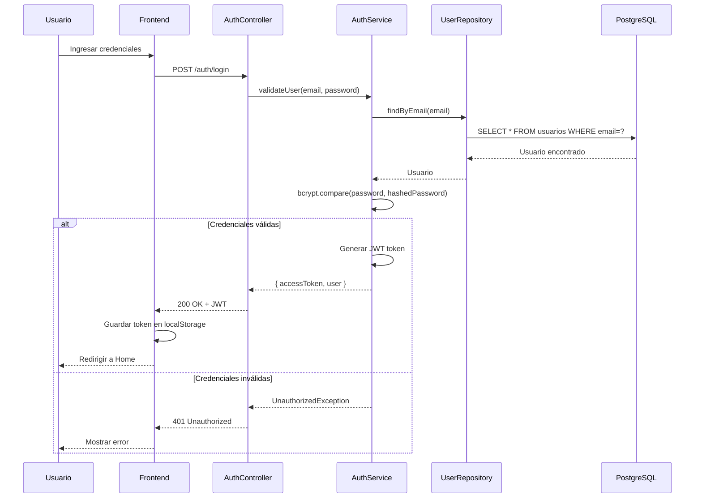
```mermaid
sequenceDiagram
    participant U as Usuario
    participant F as Frontend
    participant AC as AuthController
    participant AS as AuthService
    participant UR as UserRepository
    participant DB as PostgreSQL

    U->>F: Ingresar credenciales
    F->>AC: POST /auth/login
    AC->>AS: validateUser(email, password)
    AS->>UR: findByEmail(email)
    UR->>DB: SELECT * FROM usuarios WHERE email=?
    DB-->>UR: Usuario encontrado
    UR-->>AS: Usuario
    AS->>AS: bcrypt.compare(password, hashedPassword)

    alt Credenciales válidas
        AS->>AS: Generar JWT token
        AS-->>AC: { accessToken, user }
        AC-->>F: 200 OK + JWT
        F->>F: Guardar token en localStorage
        F-->>U: Redirigir a Home
    else Credenciales inválidas
        AS-->>AC: UnauthorizedException
        AC-->>F: 401 Unauthorized
        F-->>U: Mostrar error
    end
```

### 6.2 Guards y Decorators

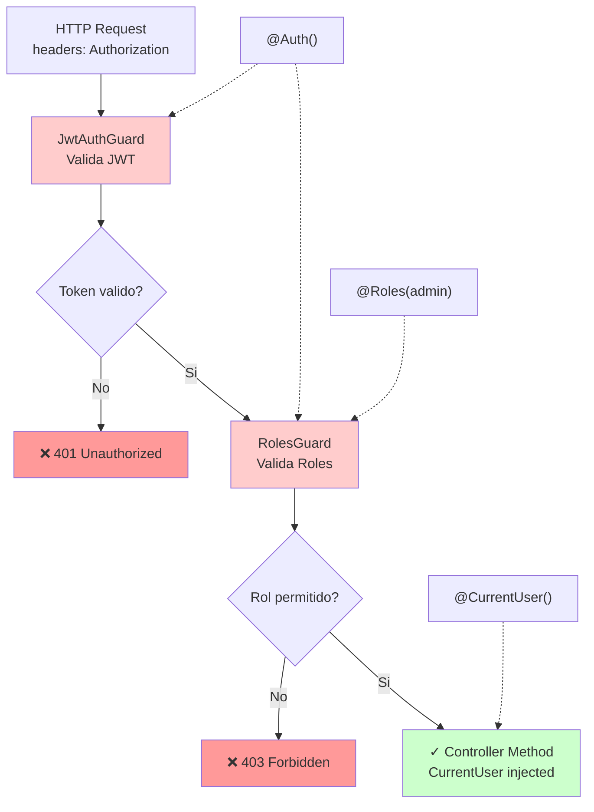
```mermaid
graph TD
    A["HTTP Request<br/>headers: Authorization"] --> B["JwtAuthGuard<br/>Valida JWT"]
    B --> C{Token valido?}
    C -->|No| D["❌ 401 Unauthorized"]
    C -->|Si| E["RolesGuard<br/>Valida Roles"]
    E --> F{Rol permitido?}
    F -->|No| G["❌ 403 Forbidden"]
    F -->|Si| H["✓ Controller Method<br/>CurrentUser injected"]

    I["@Auth()"] -.-> B
    I -.-> E
    J["@CurrentUser()"] -.-> H
    K["@Roles(admin)"] -.-> E

    style B fill:#ffcccc
    style E fill:#ffcccc
    style D fill:#ff9999
    style G fill:#ff9999
    style H fill:#ccffcc
```

### 6.3 Estructura de JWT

```typescript
interface JwtPayload {
  sub: string;        // User ID
  email: string;      // Email del usuario
  roles: string[];    // Roles del usuario ['USER', 'ADMIN', 'REVIEWER']
  iat: number;        // Issued at (timestamp)
  exp: number;        // Expiration (timestamp)
}
```

### 6.4 Implementación de Guards

**Archivos importantes:**
- `server/src/auth/guards/jwt-auth.guard.ts` - Valida JWT token
- `server/src/auth/guards/roles.guard.ts` - Valida roles del usuario
- `server/src/auth/decorators/auth.decorator.ts` - Decorator combinado @Auth()
- `server/src/auth/decorators/current-user.decorator.ts` - Extrae usuario del request

**Ejemplo de uso:**

```typescript
@Controller('products')
export class ProductsController {

  @Post()
  @Auth() // Requiere autenticación
  async createProduct(
    @CurrentUser() user: Usuario,
    @Body() createProductDto: CreateProductDto
  ) {
    return this.createProductUseCase.execute(createProductDto, user.id);
  }

  @Delete(':id')
  @Auth('ADMIN') // Requiere rol ADMIN
  async deleteProduct(@Param('id') id: string) {
    return this.deleteProductUseCase.execute(id);
  }
}
```

---

## 7. Arquitectura del Frontend

### 7.1 Estructura de Rutas

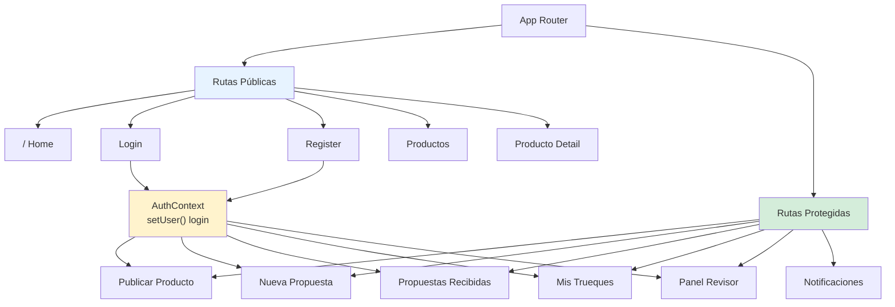
```mermaid
graph TD
    ROOT["App Router"]

    ROOT --> PUBLIC["Rutas Públicas"]
    ROOT --> PROTECTED["Rutas Protegidas"]

    PUBLIC --> H["/ Home"]
    PUBLIC --> L["Login"]
    PUBLIC --> R["Register"]
    PUBLIC --> PRODS["Productos"]
    PUBLIC --> DETAIL["Producto Detail"]

    PROTECTED --> PUB["Publicar Producto"]
    PROTECTED --> PROP["Nueva Propuesta"]
    PROTECTED --> RECV["Propuestas Recibidas"]
    PROTECTED --> TRADES["Mis Trueques"]
    PROTECTED --> REV["Panel Revisor"]
    PROTECTED --> NOTIF["Notificaciones"]

    L --> AUTH["AuthContext<br/>setUser() login"]
    R --> AUTH
    AUTH --> PUB
    AUTH --> PROP
    AUTH --> RECV
    AUTH --> TRADES
    AUTH --> REV

    style PUBLIC fill:#e7f3ff
    style PROTECTED fill:#d4edda
    style AUTH fill:#fff3cd
```

### 7.2 Componentes y Features

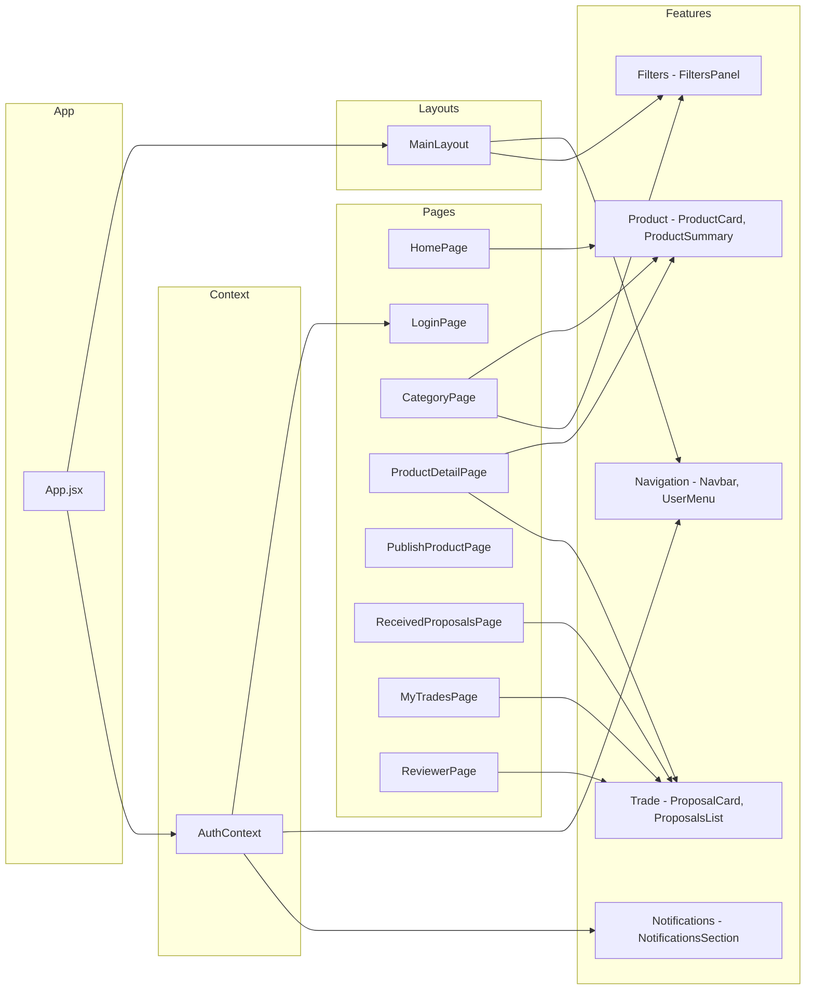
```mermaid
graph LR
    subgraph "App"
        APP[App.jsx]
    end

    subgraph "Layouts"
        ML[MainLayout]
    end

    subgraph "Context"
        AuthC[AuthContext]
    end

    subgraph "Features"
        NAV[Navigation - Navbar, UserMenu]
        PROD[Product - ProductCard, ProductSummary]
        TRADE[Trade - ProposalCard, ProposalsList]
        NOTIF[Notifications - NotificationsSection]
        FILTER[Filters - FiltersPanel]
    end

    subgraph "Pages"
        HOME[HomePage]
        LOGIN[LoginPage]
        CATEGORY[CategoryPage]
        DETAIL[ProductDetailPage]
        PUBLISH[PublishProductPage]
        PROPOSALS[ReceivedProposalsPage]
        TRADES[MyTradesPage]
        REVIEWER[ReviewerPage]
    end

    APP --> ML
    APP --> AuthC
    ML --> NAV
    ML --> FILTER

    HOME --> PROD
    CATEGORY --> PROD
    CATEGORY --> FILTER
    DETAIL --> PROD
    DETAIL --> TRADE
    PROPOSALS --> TRADE
    TRADES --> TRADE
    REVIEWER --> TRADE

    AuthC --> LOGIN
    AuthC --> NAV
    AuthC --> NOTIF
```

### 7.3 AuthContext y Estado Global

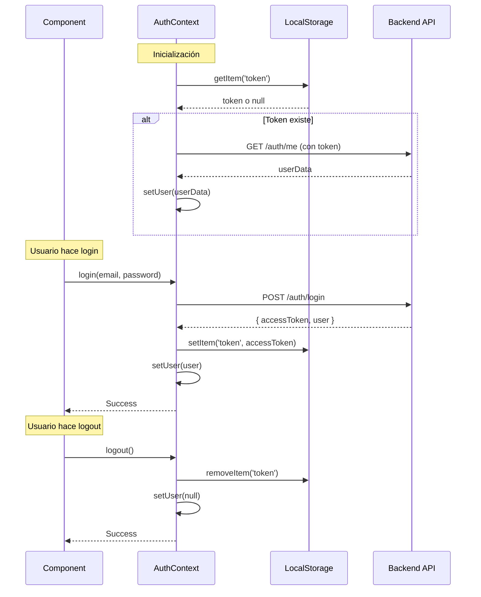
```mermaid
sequenceDiagram
    participant C as Component
    participant AC as AuthContext
    participant LS as LocalStorage
    participant API as Backend API

    Note over AC: Inicialización
    AC->>LS: getItem('token')
    LS-->>AC: token o null

    alt Token existe
        AC->>API: GET /auth/me (con token)
        API-->>AC: userData
        AC->>AC: setUser(userData)
    end

    Note over C: Usuario hace login
    C->>AC: login(email, password)
    AC->>API: POST /auth/login
    API-->>AC: { accessToken, user }
    AC->>LS: setItem('token', accessToken)
    AC->>AC: setUser(user)
    AC-->>C: Success

    Note over C: Usuario hace logout
    C->>AC: logout()
    AC->>LS: removeItem('token')
    AC->>AC: setUser(null)
    AC-->>C: Success
```

**Archivo:** `client/src/context/AuthContext.jsx`

**Funciones del contexto:**
- `login(email, password)` - Autenticar usuario
- `register(userData)` - Registrar nuevo usuario
- `logout()` - Cerrar sesión
- `user` - Usuario actual (null si no autenticado)
- `isAuthenticated` - Boolean indicando si hay sesión activa

---

## 8. Sistema de Notificaciones

### 8.1 Flujo de Notificaciones

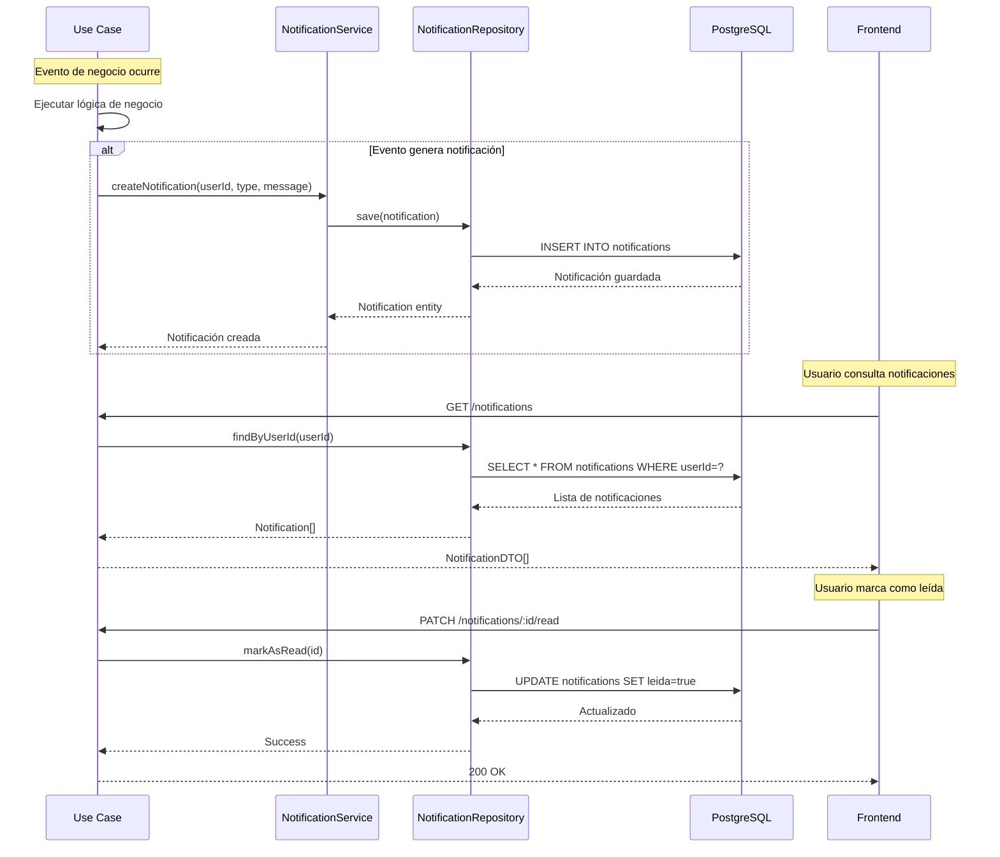
```mermaid
sequenceDiagram
    participant UC as Use Case
    participant NS as NotificationService
    participant NR as NotificationRepository
    participant DB as PostgreSQL
    participant FE as Frontend

    Note over UC: Evento de negocio ocurre
    UC->>UC: Ejecutar lógica de negocio

    alt Evento genera notificación
        UC->>NS: createNotification(userId, type, message)
        NS->>NR: save(notification)
        NR->>DB: INSERT INTO notifications
        DB-->>NR: Notificación guardada
        NR-->>NS: Notification entity
        NS-->>UC: Notificación creada
    end

    Note over FE: Usuario consulta notificaciones
    FE->>UC: GET /notifications
    UC->>NR: findByUserId(userId)
    NR->>DB: SELECT * FROM notifications WHERE userId=?
    DB-->>NR: Lista de notificaciones
    NR-->>UC: Notification[]
    UC-->>FE: NotificationDTO[]

    Note over FE: Usuario marca como leída
    FE->>UC: PATCH /notifications/:id/read
    UC->>NR: markAsRead(id)
    NR->>DB: UPDATE notifications SET leida=true
    DB-->>NR: Actualizado
    NR-->>UC: Success
    UC-->>FE: 200 OK
```

### 8.2 Tipos de Notificaciones

```typescript
enum TipoNotificacion {
  NUEVA_PROPUESTA = 'NUEVA_PROPUESTA',           // Usuario recibe propuesta
  PROPUESTA_ACEPTADA = 'PROPUESTA_ACEPTADA',     // Su propuesta fue aceptada
  PROPUESTA_RECHAZADA = 'PROPUESTA_RECHAZADA',   // Su propuesta fue rechazada
  PRODUCTO_ENVIADO = 'PRODUCTO_ENVIADO',         // Producto fue enviado
  PRODUCTO_RECIBIDO = 'PRODUCTO_RECIBIDO',       // Producto llegó a centro
  REVISION_COMPLETADA = 'REVISION_COMPLETADA',   // Revisión completada
  REVISION_APROBADA = 'REVISION_APROBADA',       // Productos aprobados
  REVISION_RECHAZADA = 'REVISION_RECHAZADA',     // Productos rechazados
  PRODUCTO_ENTREGADO = 'PRODUCTO_ENTREGADO',     // Producto entregado al usuario
  NUEVA_CALIFICACION = 'NUEVA_CALIFICACION',     // Usuario fue calificado
  TRUEQUE_COMPLETADO = 'TRUEQUE_COMPLETADO',     // Trueque finalizado
  PREGUNTA_RESPONDIDA = 'PREGUNTA_RESPONDIDA',   // Respuesta a pregunta
  ALERTA_ACTIVADA = 'ALERTA_ACTIVADA'            // Alerta de búsqueda activada
}
```

### 8.3 Eventos que Generan Notificaciones

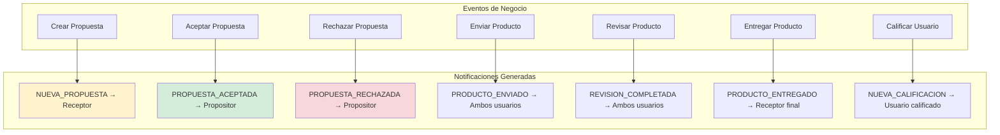
```mermaid
graph TB
    subgraph "Eventos de Negocio"
        E1[Crear Propuesta]
        E2[Aceptar Propuesta]
        E3[Rechazar Propuesta]
        E4[Enviar Producto]
        E5[Revisar Producto]
        E6[Entregar Producto]
        E7[Calificar Usuario]
    end

    subgraph "Notificaciones Generadas"
        N1[NUEVA_PROPUESTA → Receptor]
        N2[PROPUESTA_ACEPTADA → Propositor]
        N3[PROPUESTA_RECHAZADA → Propositor]
        N4[PRODUCTO_ENVIADO → Ambos usuarios]
        N5[REVISION_COMPLETADA → Ambos usuarios]
        N6[PRODUCTO_ENTREGADO → Receptor final]
        N7[NUEVA_CALIFICACION → Usuario calificado]
    end

    E1 --> N1
    E2 --> N2
    E3 --> N3
    E4 --> N4
    E5 --> N5
    E6 --> N6
    E7 --> N7

    style N1 fill:#fff3cd
    style N2 fill:#d4edda
    style N3 fill:#f8d7da
```

**Archivo:** `server/src/application/services/notification.service.ts`

---

## 9. Patrones de Diseño

### 9.1 Repository Pattern

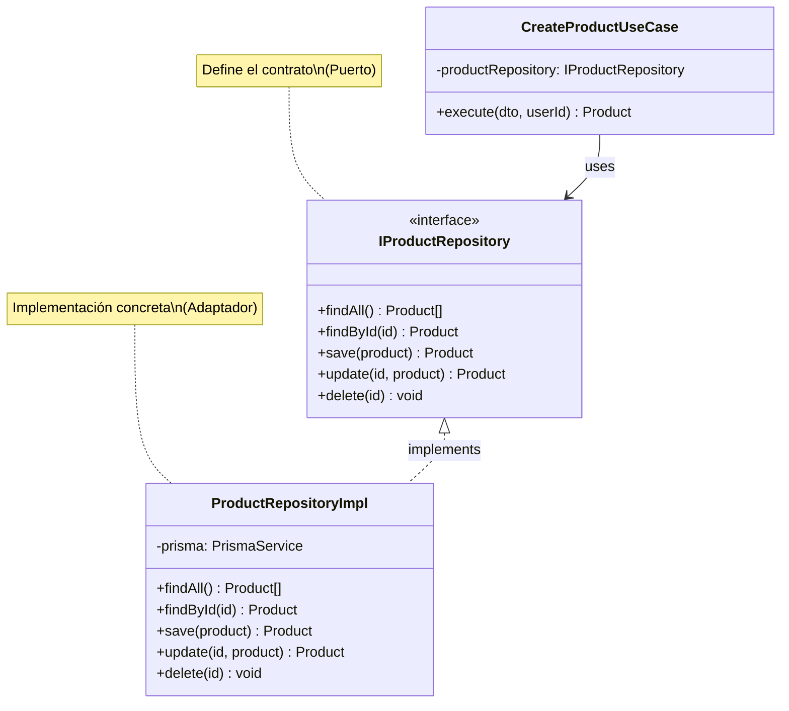
```mermaid
classDiagram
    class IProductRepository {
        <<interface>>
        +findAll() Product[]
        +findById(id) Product
        +save(product) Product
        +update(id, product) Product
        +delete(id) void
    }

    class ProductRepositoryImpl {
        -prisma: PrismaService
        +findAll() Product[]
        +findById(id) Product
        +save(product) Product
        +update(id, product) Product
        +delete(id) void
    }

    class CreateProductUseCase {
        -productRepository: IProductRepository
        +execute(dto, userId) Product
    }

    IProductRepository <|.. ProductRepositoryImpl : implements
    CreateProductUseCase --> IProductRepository : uses

    note for IProductRepository "Define el contrato\n(Puerto)"
    note for ProductRepositoryImpl "Implementación concreta\n(Adaptador)"
```

**Ventajas:**
- Desacoplamiento entre lógica de negocio y persistencia
- Facilita testing con mocks
- Permite cambiar ORM sin afectar casos de uso

**Archivos:**
- Interfaces: `server/src/domain/repositories/*.repository.ts`
- Implementaciones: `server/src/infrastructure/repositories/*.repository.impl.ts`

### 9.2 Specification Pattern

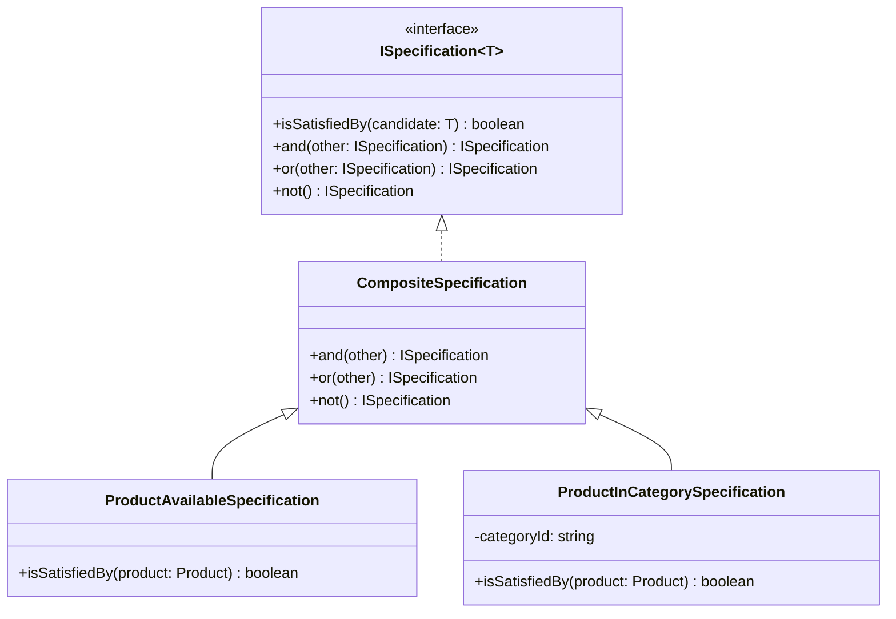
```mermaid
classDiagram
    class ISpecification~T~ {
        <<interface>>
        +isSatisfiedBy(candidate: T) boolean
        +and(other: ISpecification) ISpecification
        +or(other: ISpecification) ISpecification
        +not() ISpecification
    }

    class ProductAvailableSpecification {
        +isSatisfiedBy(product: Product) boolean
    }

    class ProductInCategorySpecification {
        -categoryId: string
        +isSatisfiedBy(product: Product) boolean
    }

    class CompositeSpecification {
        +and(other) ISpecification
        +or(other) ISpecification
        +not() ISpecification
    }

    ISpecification <|.. CompositeSpecification
    CompositeSpecification <|-- ProductAvailableSpecification
    CompositeSpecification <|-- ProductInCategorySpecification
```

**Uso:**
```typescript
const availableSpec = new ProductAvailableSpecification();
const categorySpec = new ProductInCategorySpecification('electronics');
const combinedSpec = availableSpec.and(categorySpec);

products.filter(p => combinedSpec.isSatisfiedBy(p));
```

### 9.3 State Machine Pattern

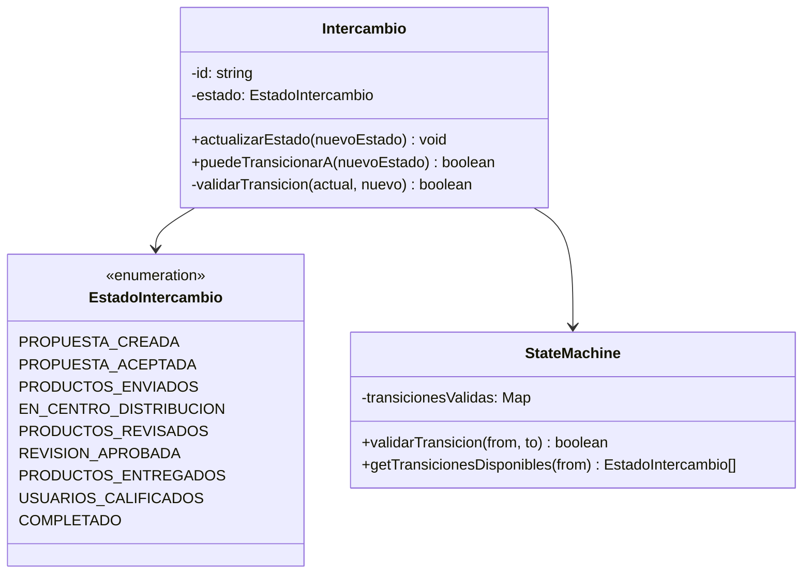
```mermaid
classDiagram
    class Intercambio {
        -id: string
        -estado: EstadoIntercambio
        +actualizarEstado(nuevoEstado) void
        +puedeTransicionarA(nuevoEstado) boolean
        -validarTransicion(actual, nuevo) boolean
    }

    class EstadoIntercambio {
        <<enumeration>>
        PROPUESTA_CREADA
        PROPUESTA_ACEPTADA
        PRODUCTOS_ENVIADOS
        EN_CENTRO_DISTRIBUCION
        PRODUCTOS_REVISADOS
        REVISION_APROBADA
        PRODUCTOS_ENTREGADOS
        USUARIOS_CALIFICADOS
        COMPLETADO
    }

    class StateMachine {
        -transicionesValidas: Map
        +validarTransicion(from, to) boolean
        +getTransicionesDisponibles(from) EstadoIntercambio[]
    }

    Intercambio --> EstadoIntercambio
    Intercambio --> StateMachine
```

**Implementación:**

```typescript
// server/src/domain/entities/intercambio.entity.ts
export class Intercambio {
  actualizarEstado(nuevoEstado: EstadoIntercambio): void {
    if (!this.puedeTransicionarA(nuevoEstado)) {
      throw new InvalidStateTransitionException(
        `No se puede transicionar de ${this.estado} a ${nuevoEstado}`
      );
    }
    this.estado = nuevoEstado;
    this.fechaActualizacion = new Date();
  }

  private puedeTransicionarA(nuevoEstado: EstadoIntercambio): boolean {
    const transicionesValidas = {
      [EstadoIntercambio.PROPUESTA_CREADA]: [
        EstadoIntercambio.PROPUESTA_ACEPTADA,
        EstadoIntercambio.PROPUESTA_RECHAZADA
      ],
      [EstadoIntercambio.PROPUESTA_ACEPTADA]: [
        EstadoIntercambio.PRODUCTOS_ENVIADOS
      ],
      // ... más transiciones
    };

    return transicionesValidas[this.estado]?.includes(nuevoEstado) ?? false;
  }
}
```

### 9.4 Command Pattern (Use Cases)

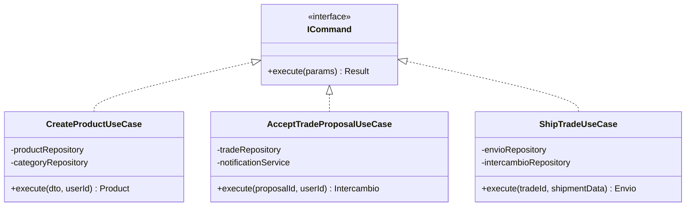
```mermaid
classDiagram
    class ICommand {
        <<interface>>
        +execute(params) Result
    }

    class CreateProductUseCase {
        -productRepository
        -categoryRepository
        +execute(dto, userId) Product
    }

    class AcceptTradeProposalUseCase {
        -tradeRepository
        -notificationService
        +execute(proposalId, userId) Intercambio
    }

    class ShipTradeUseCase {
        -envioRepository
        -intercambioRepository
        +execute(tradeId, shipmentData) Envio
    }

    ICommand <|.. CreateProductUseCase
    ICommand <|.. AcceptTradeProposalUseCase
    ICommand <|.. ShipTradeUseCase
```

**Cada Use Case:**
- Encapsula una acción de negocio
- Es independiente y reutilizable
- Orquesta múltiples repositorios/servicios
- Aplica reglas de negocio

### 9.5 DTO Pattern

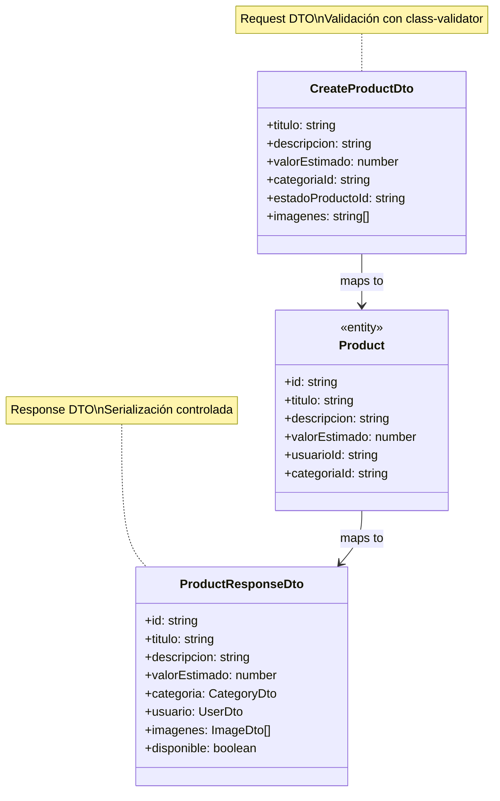
```mermaid
classDiagram
    class CreateProductDto {
        +titulo: string
        +descripcion: string
        +valorEstimado: number
        +categoriaId: string
        +estadoProductoId: string
        +imagenes: string[]
    }

    class ProductResponseDto {
        +id: string
        +titulo: string
        +descripcion: string
        +valorEstimado: number
        +categoria: CategoryDto
        +usuario: UserDto
        +imagenes: ImageDto[]
        +disponible: boolean
    }

    class Product {
        <<entity>>
        +id: string
        +titulo: string
        +descripcion: string
        +valorEstimado: number
        +usuarioId: string
        +categoriaId: string
    }

    CreateProductDto --> Product : maps to
    Product --> ProductResponseDto : maps to

    note for CreateProductDto "Request DTO\nValidación con class-validator"
    note for ProductResponseDto "Response DTO\nSerialización controlada"
```

---

## 10. Comparativa Backend/Frontend

### 10.1 Tabla de Tecnologías

| Aspecto | Backend | Frontend |
|---------|---------|----------|
| **Framework** | NestJS | React 18 |
| **Lenguaje** | TypeScript | JavaScript (JSX) |
| **Build Tool** | TypeScript Compiler | Vite |
| **Routing** | NestJS Routing | React Router v6 |
| **Estado Global** | Inyección de Dependencias | Context API |
| **HTTP Client** | - | Axios |
| **Validación** | class-validator, class-transformer | Validación manual |
| **Base de Datos** | PostgreSQL + Prisma | - |
| **Autenticación** | JWT + Passport | JWT en localStorage |
| **Testing** | Jest + Supertest | - |
| **Arquitectura** | Hexagonal + DDD | Basada en Features |

### 10.2 Responsabilidades

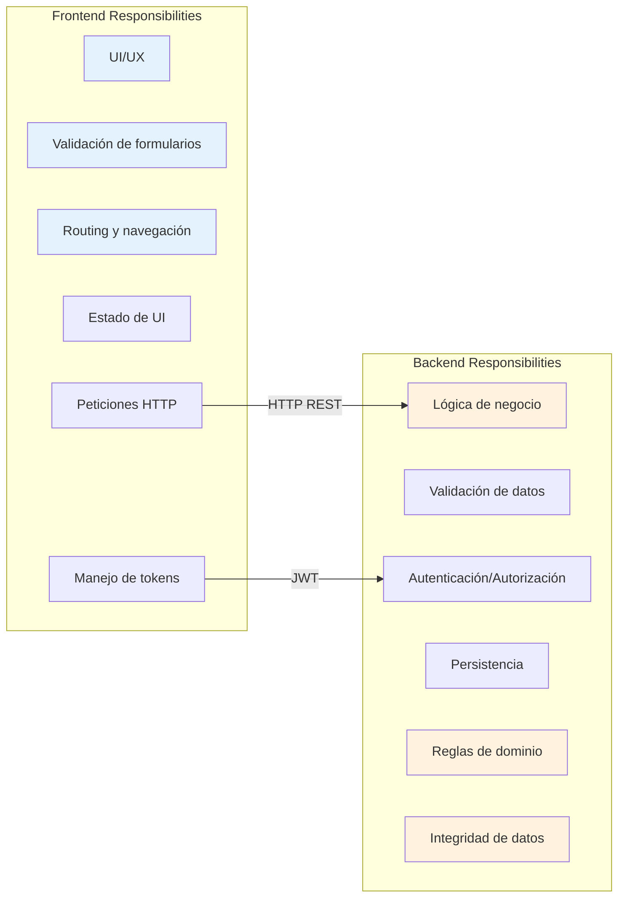
```mermaid
graph LR
    subgraph "Frontend Responsibilities"
        F1[UI/UX]
        F2[Validación de formularios]
        F3[Routing y navegación]
        F4[Estado de UI]
        F5[Peticiones HTTP]
        F6[Manejo de tokens]
    end

    subgraph "Backend Responsibilities"
        B1[Lógica de negocio]
        B2[Validación de datos]
        B3[Autenticación/Autorización]
        B4[Persistencia]
        B5[Reglas de dominio]
        B6[Integridad de datos]
    end

    F5 --> |HTTP REST| B1
    F6 --> |JWT| B3

    style F1 fill:#e3f2fd
    style F2 fill:#e3f2fd
    style F3 fill:#e3f2fd
    style B1 fill:#fff3e0
    style B5 fill:#fff3e0
    style B6 fill:#fff3e0
```

### 10.3 Patrones Comunes

**Backend:**
- Repository Pattern
- Specification Pattern
- State Machine Pattern
- Command Pattern (Use Cases)
- Dependency Injection
- Guard Pattern
- Exception Filters

**Frontend:**
- Container/Presentational Components
- Custom Hooks
- Context API para estado global
- Protected Routes
- Lazy Loading
- Composition Pattern

---

## Decisiones Arquitectónicas

### ADR 001: Arquitectura Hexagonal

**Estado:** Aceptado

**Contexto:**
Necesitábamos una arquitectura que permitiera:
- Testabilidad alta
- Independencia de frameworks
- Bajo acoplamiento entre capas
- Facilidad de mantenimiento

**Decisión:**
Implementar Arquitectura Hexagonal con 4 capas (Presentation, Application, Domain, Infrastructure).

**Consecuencias:**

**Positivas:**
- Reglas de negocio en capa de dominio, independientes de infraestructura
- Fácil reemplazo de Prisma por otro ORM
- Use Cases testeables sin base de datos
- Clara separación de responsabilidades

**Negativas:**
- Mayor complejidad inicial
- Más archivos y boilerplate
- Curva de aprendizaje para nuevos desarrolladores

---

### ADR 002: Prisma como ORM

**Estado:** Aceptado

**Contexto:**
Necesitábamos un ORM moderno para TypeScript con buen soporte de tipos y migraciones.

**Decisión:**
Usar Prisma como ORM principal.

**Consecuencias:**

**Positivas:**
- Excelente soporte de TypeScript
- Migraciones automáticas
- Prisma Studio para debugging
- Type-safety en queries
- Buen rendimiento

**Negativas:**
- Vendor lock-in moderado
- Queries complejas requieren raw SQL ocasionalmente
- Tamaño del cliente generado

**Alternativas Consideradas:**
- TypeORM: Descartado por problemas de tipos y bugs
- Sequelize: Descartado por falta de type-safety

---

### ADR 003: Context API en vez de Redux

**Estado:** Aceptado

**Contexto:**
Necesitábamos manejo de estado global en el frontend, principalmente para autenticación.

**Decisión:**
Usar Context API nativo de React.

**Consecuencias:**

**Positivas:**
- Sin dependencias externas
- Más simple y ligero
- Suficiente para nuestras necesidades
- Menos boilerplate

**Negativas:**
- No tiene devtools como Redux
- Puede causar re-renders innecesarios si no se usa correctamente
- No tiene middleware nativo

**Alternativas Consideradas:**
- Redux Toolkit: Overkill para nuestro caso de uso
- Zustand: Considerado pero preferimos APIs nativas

---

### ADR 004: State Machine para Trueques

**Estado:** Aceptado

**Contexto:**
El sistema de trueque tiene múltiples estados y transiciones complejas que deben validarse.

**Decisión:**
Implementar State Machine Pattern en la entidad Intercambio.

**Consecuencias:**

**Positivas:**
- Transiciones de estado validadas en dominio
- Imposible llegar a estados inconsistentes
- Lógica centralizada y testeable
- Fácil agregar nuevos estados

**Negativas:**
- Complejidad inicial mayor
- Requiere documentación clara de estados

---

### ADR 005: Monorepo con client/ y server/

**Estado:** Aceptado

**Contexto:**
Necesitábamos organizar frontend y backend en un mismo repositorio.

**Decisión:**
Estructura monorepo con carpetas separadas `client/` y `server/`.

**Consecuencias:**

**Positivas:**
- Código relacionado en un solo repo
- Más fácil mantener sincronizados
- Deploy simplificado
- Historia de cambios unificada

**Negativas:**
- Riesgo de acoplamiento no intencional
- package.json separados (no hay workspace setup)
- CI/CD debe manejar ambos proyectos

---

## Referencias

### Archivos Importantes

**Backend:**
```
server/
├── src/
│   ├── presentation/
│   │   └── controllers/
│   │       ├── products.controller.ts
│   │       ├── trades.controller.ts
│   │       ├── proposals.controller.ts
│   │       └── notifications.controller.ts
│   ├── application/
│   │   ├── use-cases/
│   │   │   ├── create-product.use-case.ts
│   │   │   ├── create-trade-proposal.use-case.ts
│   │   │   ├── accept-trade-proposal.use-case.ts
│   │   │   ├── ship-trade.use-case.ts
│   │   │   ├── review-trade.use-case.ts
│   │   │   ├── deliver-trade.use-case.ts
│   │   │   └── rate-trade.use-case.ts
│   │   └── services/
│   │       └── notification.service.ts
│   ├── domain/
│   │   ├── entities/
│   │   │   ├── product.entity.ts
│   │   │   ├── user.entity.ts
│   │   │   ├── intercambio.entity.ts
│   │   │   ├── trade-proposal.entity.ts
│   │   │   ├── envio.entity.ts
│   │   │   ├── revision-producto.entity.ts
│   │   │   ├── review.entity.ts
│   │   │   └── notification.entity.ts
│   │   └── repositories/
│   │       ├── product.repository.ts
│   │       ├── user.repository.ts
│   │       ├── intercambio.repository.ts
│   │       └── notification.repository.ts
│   ├── infrastructure/
│   │   └── repositories/
│   │       ├── product.repository.impl.ts
│   │       ├── user.repository.impl.ts
│   │       └── intercambio.repository.impl.ts
│   ├── auth/
│   │   ├── guards/
│   │   │   ├── jwt-auth.guard.ts
│   │   │   └── roles.guard.ts
│   │   ├── decorators/
│   │   │   ├── auth.decorator.ts
│   │   │   └── current-user.decorator.ts
│   │   ├── auth.service.ts
│   │   └── auth.controller.ts
│   └── prisma/
│       └── schema.prisma
```

**Frontend:**
```
client/
├── src/
│   ├── context/
│   │   └── AuthContext.jsx
│   ├── pages/
│   │   ├── Home/
│   │   ├── login/
│   │   ├── category/
│   │   ├── productDetail/
│   │   ├── publishProduct/
│   │   ├── trade/
│   │   │   ├── TradeProposalPage.jsx
│   │   │   ├── ReceivedProposalsPage.jsx
│   │   │   ├── MyTradesPage.jsx
│   │   │   └── ShipTradeProposalPage.jsx
│   │   └── reviewer/
│   │       └── ReviewerPage.jsx
│   ├── features/
│   │   ├── navigation/
│   │   ├── product/
│   │   ├── trade/
│   │   ├── notifications/
│   │   └── filters/
│   ├── app/
│   │   ├── routes/
│   │   │   └── ProtectedRoute.jsx
│   │   └── layouts/
│   │       └── MainLayout.jsx
│   └── App.jsx
```

### Documentación Relacionada

- [Swagger API Documentation](http://localhost:3000/api) - Documentación interactiva de la API
- [Prisma Schema](../server/prisma/schema.prisma) - Modelo de datos
- [Auth README](../server/src/auth/README.md) - Documentación de autenticación

### Recursos Externos

- [NestJS Documentation](https://docs.nestjs.com/)
- [Prisma Documentation](https://www.prisma.io/docs)
- [Hexagonal Architecture](https://alistair.cockburn.us/hexagonal-architecture/)
- [Domain-Driven Design](https://martinfowler.com/bliki/DomainDrivenDesign.html)
- [React Documentation](https://react.dev/)

---

## Diagramas Adicionales

### Diagrama de Deployment

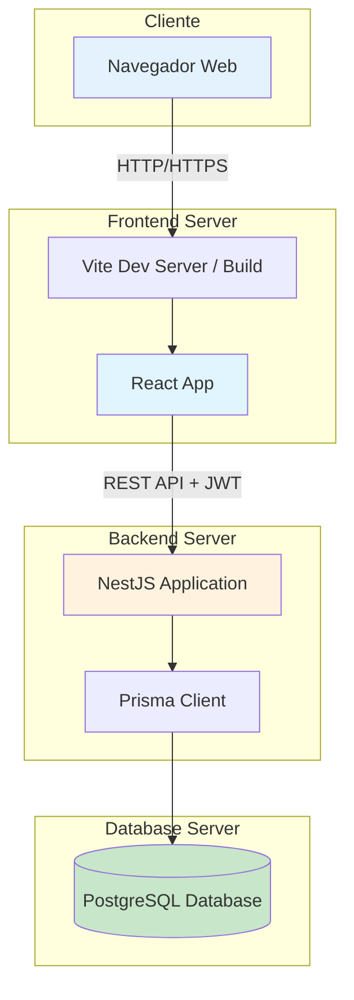
```mermaid
graph TB
    subgraph "Cliente"
        Browser[Navegador Web]
    end

    subgraph "Frontend Server"
        Vite[Vite Dev Server / Build]
        React[React App]
    end

    subgraph "Backend Server"
        NestJS[NestJS Application]
        Prisma[Prisma Client]
    end

    subgraph "Database Server"
        PostgreSQL[(PostgreSQL Database)]
    end

    Browser -->|HTTP/HTTPS| Vite
    Vite --> React
    React -->|REST API + JWT| NestJS
    NestJS --> Prisma
    Prisma --> PostgreSQL

    style Browser fill:#e3f2fd
    style React fill:#e1f5fe
    style NestJS fill:#fff3e0
    style PostgreSQL fill:#c8e6c9
```

---

**Última actualización:** 2025-11-19
**Versión:** 1.0
**Autores:** Equipo Mercado Trueque
