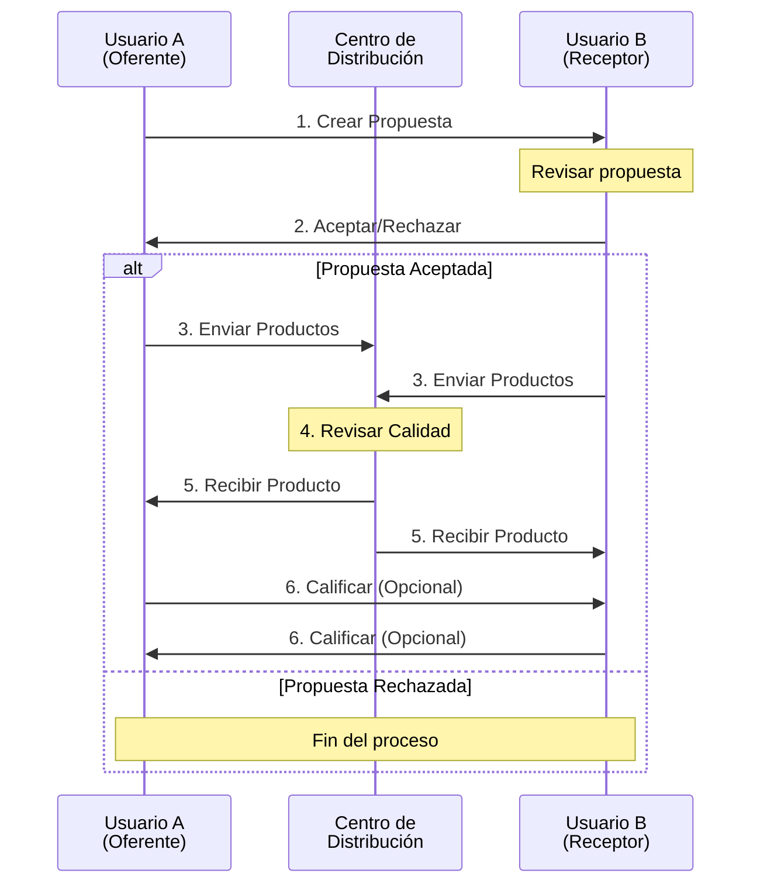
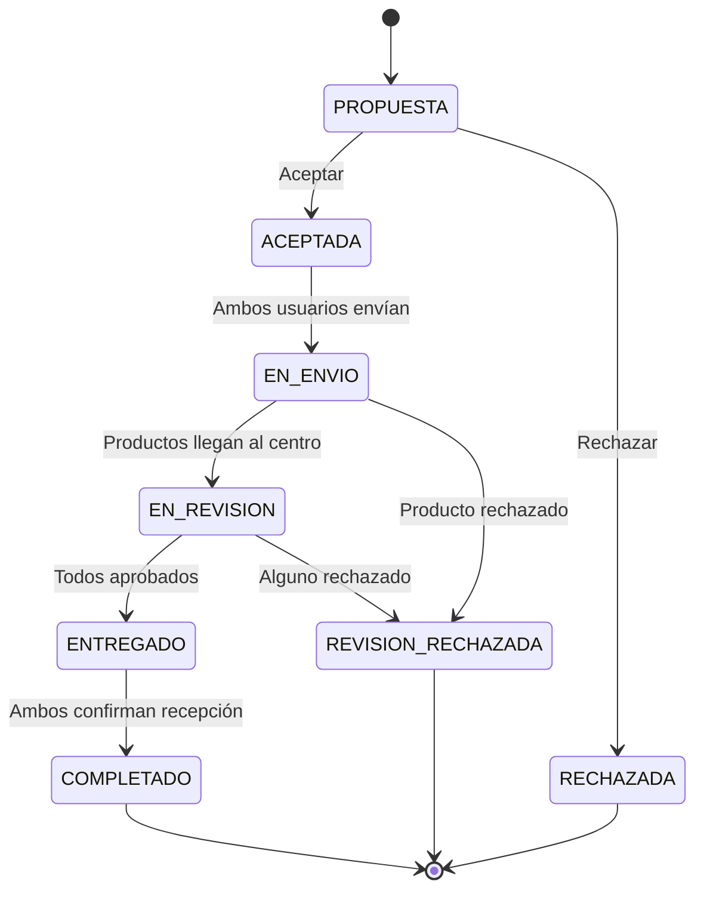
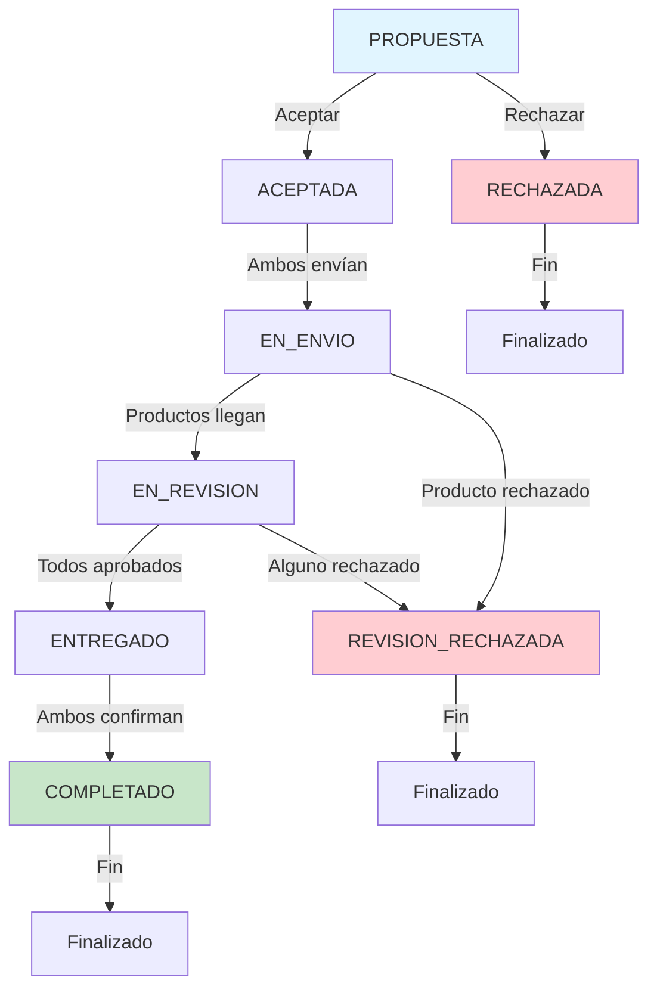

# Guía Completa de las Fases del Sistema de Trueque

## Tabla de Contenidos

- [Introducción](#introducción)
- [Visión General del Flujo](#visión-general-del-flujo)
- [Máquina de Estados](#máquina-de-estados)
- [Fase 1: Crear Propuesta](#fase-1-crear-propuesta)
- [Fase 2: Aceptar Propuesta](#fase-2-aceptar-propuesta)
- [Fase 3: Enviar Productos](#fase-3-enviar-productos)
- [Fase 4: Revisar Productos](#fase-4-revisar-productos)
- [Fase 5: Entregar Productos](#fase-5-entregar-productos)
- [Fase 6: Calificar Usuario](#fase-6-calificar-usuario)
- [Tabla de Referencia Rápida](#tabla-de-referencia-rápida)
- [Casos de Uso Completos](#casos-de-uso-completos)
- [Estados del Sistema](#estados-del-sistema)
- [Preguntas Frecuentes](#preguntas-frecuentes)

---

## Introducción

El **Sistema de Trueque de Mercado Trueque** permite a los usuarios intercambiar productos de manera segura y transparente. El sistema gestiona todo el proceso desde la propuesta inicial hasta la entrega final, pasando por un centro de distribución que garantiza la calidad de los productos.

### Características Principales

- **Propuestas flexibles**: Ofrece de 1 a 5 productos para obtener 1 producto deseado
- **Centro de distribución**: Punto intermedio que inspecciona y valida la calidad de los productos
- **Trazabilidad completa**: Seguimiento de cada producto mediante códigos de tracking
- **Sistema de calificaciones**: Los usuarios se califican mutuamente para generar reputación
- **Máquina de estados robusta**: Garantiza la integridad del proceso en cada fase

### Actores del Sistema

1. **Usuario Oferente**: Inicia la propuesta de trueque
2. **Usuario Receptor**: Dueño del producto solicitado, acepta o rechaza la propuesta
3. **Centro de Distribución**: Entidad que recibe, inspecciona y distribuye los productos

---

## Visión General del Flujo



---

## Máquina de Estados

El sistema utiliza una máquina de estados para garantizar la integridad del proceso:



### Estados Posibles

| Estado | Descripción |
|--------|-------------|
| `PROPUESTA` | Propuesta creada, esperando respuesta |
| `ACEPTADA` | Propuesta aceptada, esperando envíos |
| `RECHAZADA` | Propuesta rechazada por el receptor |
| `AUTO_RECHAZADA` | Propuesta rechazada automáticamente (ej: producto no disponible) |
| `EN_ENVIO` | Al menos un usuario ha enviado sus productos |
| `EN_REVISION` | Productos en el centro, siendo revisados |
| `REVISION_RECHAZADA` | Uno o más productos fueron rechazados en la inspección |
| `ENTREGADO` | Productos aprobados y enviados a destinatarios |
| `COMPLETADO` | Ambos usuarios confirmaron recepción |

---

## Fase 1: Crear Propuesta

### Descripción General

El usuario oferente crea una propuesta de trueque ofreciendo de 1 a 5 productos propios para obtener 1 producto de otro usuario.

### Endpoint

```http
POST /trades/proposals
```

### Autenticación

```
Authorization: Bearer {access_token}
```

### Estructura de Entrada

```json
{
  "usuario_oferente_id": "550e8400-e29b-41d4-a716-446655440000",
  "productos_ofrecidos": [
    "660e8400-e29b-41d4-a716-446655440001",
    "770e8400-e29b-41d4-a716-446655440002"
  ],
  "producto_solicitado_id": "880e8400-e29b-41d4-a716-446655440003",
  "mensaje": "Hola! Estoy interesado en tu bicicleta. Te ofrezco mi patineta y casco."
}
```

### Parámetros

| Campo | Tipo | Requerido | Descripción |
|-------|------|-----------|-------------|
| `usuario_oferente_id` | UUID | Sí | ID del usuario que hace la propuesta |
| `productos_ofrecidos` | UUID[] | Sí | Array de IDs de productos ofrecidos (1-5) |
| `producto_solicitado_id` | UUID | Sí | ID del producto que se desea obtener |
| `mensaje` | string | Opcional | Mensaje personalizado para el receptor |

### Estructura de Salida

```json
{
  "id": "990e8400-e29b-41d4-a716-446655440004",
  "usuario_oferente_id": "550e8400-e29b-41d4-a716-446655440000",
  "producto_solicitado_id": "880e8400-e29b-41d4-a716-446655440003",
  "estado": "PROPUESTA",
  "mensaje": "Hola! Estoy interesado en tu bicicleta. Te ofrezco mi patineta y casco.",
  "fecha_propuesta": "2025-11-19T10:30:00.000Z",
  "fecha_respuesta": null
}
```

### Validaciones y Reglas de Negocio

1. **Cantidad de productos ofrecidos**: Mínimo 1, máximo 5
2. **Productos propios**: El usuario solo puede ofrecer productos que le pertenezcan
3. **Productos disponibles**: Los productos ofrecidos deben tener `disponible = true`
4. **No auto-trueque**: El producto solicitado no puede pertenecer al usuario oferente
5. **Producto solicitado único**: Solo se puede solicitar 1 producto por propuesta
6. **Producto solicitado disponible**: El producto solicitado debe estar disponible

### Estados

- **Estado Antes**: N/A (no existe)
- **Estado Después**: `PROPUESTA`

### Notas Especiales

- Al crear la propuesta, se envía una notificación al dueño del producto solicitado
- Los productos ofrecidos quedan reservados (no se pueden usar en otras propuestas simultáneas)
- La propuesta no tiene fecha de expiración automática (puede permanecer pendiente indefinidamente)

### Códigos de Error

| Código | Descripción |
|--------|-------------|
| `400` | Datos inválidos (validación fallida) |
| `401` | No autenticado |
| `403` | Usuario no es dueño de los productos ofrecidos |
| `404` | Producto solicitado no encontrado |
| `409` | Productos no disponibles o ya están en otra propuesta |

---

## Fase 2: Aceptar Propuesta

### Descripción General

El dueño del producto solicitado revisa la propuesta y decide aceptarla o rechazarla. Al aceptar, se crea automáticamente un **intercambio** que gestiona todo el proceso posterior y se asigna un centro de distribución.

### Endpoint

```http
POST /trades/proposals/:proposalId/accept
```

### Autenticación

```
Authorization: Bearer {access_token}
```

### Estructura de Entrada

```json
{
  "usuario_aceptante_id": "aa0e8400-e29b-41d4-a716-446655440005"
}
```

### Parámetros URL

| Campo | Tipo | Descripción |
|-------|------|-------------|
| `proposalId` | UUID | ID de la propuesta a aceptar |

### Parámetros Body

| Campo | Tipo | Requerido | Descripción |
|-------|------|-----------|-------------|
| `usuario_aceptante_id` | UUID | Sí | ID del usuario que acepta (debe ser dueño del producto solicitado) |

### Estructura de Salida

```json
{
  "id": "bb0e8400-e29b-41d4-a716-446655440006",
  "propuesta_id": "990e8400-e29b-41d4-a716-446655440004",
  "estado": "ACEPTADA",
  "fecha_inicio": "2025-11-19T11:00:00.000Z",
  "centro_distribucion_id": "cc0e8400-e29b-41d4-a716-446655440007",
  "fecha_completado": null
}
```

### Validaciones y Reglas de Negocio

1. **Usuario autorizado**: Solo el dueño del producto solicitado puede aceptar
2. **Propuesta pendiente**: La propuesta debe estar en estado `PROPUESTA`
3. **Productos disponibles**: Todos los productos involucrados deben seguir disponibles
4. **Centro automático**: El sistema asigna automáticamente el centro de distribución más cercano
5. **Creación de intercambio**: Se crea una entidad `Intercambio` que gestiona el resto del proceso

### Estados

- **Estado Antes**: `PROPUESTA`
- **Estado Después**: `ACEPTADA`

### Notas Especiales

- Al aceptar, se notifica al usuario oferente
- Los productos de ambos usuarios se marcan como "en proceso de intercambio"
- Se crea un registro de intercambio con estado inicial `ACEPTADA`
- El centro de distribución se asigna basándose en la ubicación de ambos usuarios

### Códigos de Error

| Código | Descripción |
|--------|-------------|
| `400` | Datos inválidos |
| `401` | No autenticado |
| `403` | Usuario no autorizado (no es dueño del producto solicitado) |
| `404` | Propuesta no encontrada |
| `409` | Propuesta ya fue respondida o productos no disponibles |

### Rechazar Propuesta

Para rechazar una propuesta, el endpoint es similar pero sin crear intercambio:

```http
POST /trades/proposals/:proposalId/reject
```

Esto cambia el estado de la propuesta a `RECHAZADA` y libera los productos.

---

## Fase 3: Enviar Productos

### Descripción General

Ambos usuarios envían sus productos al centro de distribución asignado. Se genera un código de tracking para cada envío. Esta fase se ejecuta **DOS VECES**: una vez por cada usuario. Cuando ambos completan el envío, el estado cambia a `PRODUCTOS_ENVIADOS`.

### Endpoint

```http
POST /trades/:intercambioId/ship
```

### Autenticación

```
Authorization: Bearer {access_token}
```

### Estructura de Entrada

```json
{
  "usuario_id": "550e8400-e29b-41d4-a716-446655440000",
  "intercambio_id": "bb0e8400-e29b-41d4-a716-446655440006",
  "origen_direccion": "Calle 123 #45-67, Bogotá",
  "destino_direccion": "Centro Distribución Norte, Av. 68 #80-90",
  "notas_envio": "Producto empacado en caja original con protección adicional"
}
```

### Parámetros URL

| Campo | Tipo | Descripción |
|-------|------|-------------|
| `intercambioId` | UUID | ID del intercambio |

### Parámetros Body

| Campo | Tipo | Requerido | Descripción |
|-------|------|-----------|-------------|
| `usuario_id` | UUID | Sí | ID del usuario que envía |
| `intercambio_id` | UUID | Sí | ID del intercambio |
| `origen_direccion` | string | Sí | Dirección desde donde se envía |
| `destino_direccion` | string | Sí | Dirección del centro de distribución |
| `notas_envio` | string | Opcional | Notas adicionales sobre el envío |

### Estructura de Salida

```json
{
  "id": "dd0e8400-e29b-41d4-a716-446655440008",
  "intercambio_id": "bb0e8400-e29b-41d4-a716-446655440006",
  "usuario_id": "550e8400-e29b-41d4-a716-446655440000",
  "tracking_code": "TRK-2025-001234",
  "origen_direccion": "Calle 123 #45-67, Bogotá",
  "destino_direccion": "Centro Distribución Norte, Av. 68 #80-90",
  "estado_envio": "EN_TRANSITO",
  "fecha_envio": "2025-11-19T12:00:00.000Z",
  "fecha_llegada": null,
  "notas": "Producto empacado en caja original con protección adicional"
}
```

### Validaciones y Reglas de Negocio

1. **Usuario participante**: Solo los usuarios del intercambio pueden enviar
2. **Un envío por usuario**: Cada usuario solo puede enviar una vez
3. **Estado válido**: El intercambio debe estar en estado `ACEPTADA` o `EN_ENVIO`
4. **Tracking único**: Se genera un código de tracking único por envío
5. **Cambio de estado automático**: Cuando ambos envían, estado cambia a `EN_ENVIO`

### Estados

- **Estado Antes**: `ACEPTADA` o `EN_ENVIO` (primer envío)
- **Estado Después**: `EN_ENVIO` (después del segundo envío, cuando ambos completaron)

### Notas Especiales

- El código de tracking se genera automáticamente con formato `TRK-{año}-{número}`
- Se notifica al otro usuario cuando su contraparte ha enviado
- El sistema no valida físicamente el envío (eso lo hace el centro después)
- Ambos usuarios deben completar esta fase para avanzar

### Códigos de Error

| Código | Descripción |
|--------|-------------|
| `400` | Datos inválidos |
| `401` | No autenticado |
| `403` | Usuario no es parte del intercambio |
| `404` | Intercambio no encontrado |
| `409` | Usuario ya envió sus productos o estado inválido |

---

## Fase 4: Revisar Productos

### Descripción General

El centro de distribución recibe los productos y realiza una inspección de calidad. Cada producto recibe una calificación de 1 a 5 estrellas. Productos con calificación >= 3 son **APROBADOS**, mientras que calificación < 3 son **RECHAZADOS**. Esta fase se ejecuta para cada producto involucrado en el intercambio.

### Endpoint

```http
POST /trades/:intercambioId/products/:productId/review
```

### Autenticación

```
Authorization: Bearer {access_token}
```

### Estructura de Entrada

```json
{
  "intercambio_id": "bb0e8400-e29b-41d4-a716-446655440006",
  "producto_id": "660e8400-e29b-41d4-a716-446655440001",
  "condition_rating": 4,
  "observations": "Producto en excelente estado, sin rayones ni daños visibles. Empaque original intacto.",
  "photos": [
    "https://storage.example.com/review-photos/producto1-foto1.jpg",
    "https://storage.example.com/review-photos/producto1-foto2.jpg"
  ]
}
```

### Parámetros URL

| Campo | Tipo | Descripción |
|-------|------|-------------|
| `intercambioId` | UUID | ID del intercambio |
| `productId` | UUID | ID del producto a revisar |

### Parámetros Body

| Campo | Tipo | Requerido | Descripción |
|-------|------|-----------|-------------|
| `intercambio_id` | UUID | Sí | ID del intercambio |
| `producto_id` | UUID | Sí | ID del producto siendo revisado |
| `condition_rating` | number | Sí | Calificación de 1 a 5 estrellas |
| `observations` | string | Opcional | Observaciones detalladas (mínimo 20 caracteres) |
| `photos` | string[] | Opcional | URLs de fotos de la inspección |

### Estructura de Salida

```json
{
  "id": "ee0e8400-e29b-41d4-a716-446655440009",
  "intercambio_id": "bb0e8400-e29b-41d4-a716-446655440006",
  "producto_id": "660e8400-e29b-41d4-a716-446655440001",
  "calificacion_producto": 4,
  "estado_revision": "APROBADO",
  "fecha_revision": "2025-11-19T14:00:00.000Z"
}
```

### Validaciones y Reglas de Negocio

1. **Calificación válida**: De 1 a 5 estrellas
2. **Criterio de aprobación**:
   - `rating >= 3`: APROBADO
   - `rating < 3`: RECHAZADO
3. **Observaciones mínimas**: Si se incluyen, mínimo 20 caracteres
4. **Estado del intercambio**: Debe estar en `EN_ENVIO` (productos ya llegaron)
5. **Producto del intercambio**: El producto debe ser parte de este intercambio
6. **Una revisión por producto**: No se puede revisar el mismo producto dos veces
7. **Cambio de estado**: Cuando TODOS los productos están aprobados, estado cambia a `EN_REVISION`

### Estados

- **Estado Antes**: `EN_ENVIO`
- **Estado Después**: `EN_REVISION` (cuando todos los productos están aprobados)
- **Estado Alternativo**: `REVISION_RECHAZADA` (si algún producto es rechazado)

### Notas Especiales

- Esta fase requiere permisos de administrador o centro de distribución
- Si un producto es rechazado, el intercambio completo se puede cancelar o negociar
- Las fotos de la inspección quedan como evidencia permanente
- Ambos usuarios son notificados del resultado de las inspecciones
- La calificación del producto puede afectar la reputación del dueño

### Códigos de Error

| Código | Descripción |
|--------|-------------|
| `400` | Datos inválidos (calificación fuera de rango, observaciones muy cortas) |
| `401` | No autenticado |
| `403` | Usuario no tiene permisos de revisor |
| `404` | Intercambio o producto no encontrado |
| `409` | Producto ya fue revisado o no está en el intercambio |

---

## Fase 5: Entregar Productos

### Descripción General

Los productos aprobados son enviados desde el centro de distribución a sus destinatarios finales. Cada usuario marca como recibido cuando obtiene su producto. Esta fase se ejecuta **DOS VECES**: una vez por cada usuario. Cuando ambos marcan como entregado, el estado cambia a `COMPLETADO`.

### Endpoint

```http
POST /trades/:intercambioId/deliver
```

### Autenticación

```
Authorization: Bearer {access_token}
```

### Estructura de Entrada

```json
{
  "usuario_id": "aa0e8400-e29b-41d4-a716-446655440005",
  "intercambio_id": "bb0e8400-e29b-41d4-a716-446655440006",
  "delivery_address": "Carrera 45 #78-90, Apartamento 301, Medellín",
  "delivery_notes": "Dejar con portería si no estoy en casa"
}
```

### Parámetros URL

| Campo | Tipo | Descripción |
|-------|------|-------------|
| `intercambioId` | UUID | ID del intercambio |

### Parámetros Body

| Campo | Tipo | Requerido | Descripción |
|-------|------|-----------|-------------|
| `usuario_id` | UUID | Sí | ID del usuario que recibe |
| `intercambio_id` | UUID | Opcional | ID del intercambio (redundante con URL) |
| `delivery_address` | string | Sí | Dirección de entrega final |
| `delivery_notes` | string | Opcional | Notas para el delivery |

### Estructura de Salida

```json
{
  "id": "bb0e8400-e29b-41d4-a716-446655440006",
  "intercambio_id": "bb0e8400-e29b-41d4-a716-446655440006",
  "estado": "ENTREGADO",
  "fecha_completado": "2025-11-19T16:00:00.000Z"
}
```

### Validaciones y Reglas de Negocio

1. **Usuario participante**: Solo usuarios del intercambio pueden confirmar recepción
2. **Una confirmación por usuario**: Cada usuario solo puede confirmar una vez
3. **Estado válido**: El intercambio debe estar en `EN_REVISION` o `ENTREGADO` (primer delivery)
4. **Productos aprobados**: Solo se entregan si todos los productos fueron aprobados
5. **Cambio de estado**: Cuando ambos confirman, estado cambia a `COMPLETADO`

### Estados

- **Estado Antes**: `EN_REVISION` o `ENTREGADO` (primer delivery)
- **Estado Después**: `ENTREGADO` (primer usuario) → `COMPLETADO` (segundo usuario)

### Notas Especiales

- Esta fase confirma que el usuario ha recibido satisfactoriamente su producto
- La confirmación es irreversible
- Después de completar, los usuarios pueden proceder a la calificación (Fase 6)
- El sistema registra la fecha exacta de cada confirmación
- Se notifica al otro usuario cuando su contraparte ha confirmado recepción

### Códigos de Error

| Código | Descripción |
|--------|-------------|
| `400` | Datos inválidos |
| `401` | No autenticado |
| `403` | Usuario no es parte del intercambio |
| `404` | Intercambio no encontrado |
| `409` | Usuario ya confirmó recepción, estado inválido, o productos no aprobados |

---

## Fase 6: Calificar Usuario

### Descripción General

Después de completar el intercambio, los usuarios pueden calificarse mutuamente. Esta calificación afecta la reputación del usuario en la plataforma. Esta fase es **OPCIONAL** y se ejecuta **DOS VECES** (cada usuario califica al otro).

### Endpoint

```http
POST /trades/:intercambioId/rate
```

### Autenticación

```
Authorization: Bearer {access_token}
```

### Estructura de Entrada

```json
{
  "usuario_id": "550e8400-e29b-41d4-a716-446655440000",
  "intercambio_id": "bb0e8400-e29b-41d4-a716-446655440006",
  "usuario_calificado_id": "aa0e8400-e29b-41d4-a716-446655440005",
  "calificacion_usuario": 5,
  "calificacion_producto": 4,
  "comentario": "Excelente experiencia! El producto llegó tal como se describió. Usuario muy responsable y comunicativo.",
  "aspectos_positivos": [
    "Buena comunicación",
    "Producto bien empacado",
    "Envío rápido"
  ],
  "aspectos_negativos": []
}
```

### Parámetros URL

| Campo | Tipo | Descripción |
|-------|------|-------------|
| `intercambioId` | UUID | ID del intercambio completado |

### Parámetros Body

| Campo | Tipo | Requerido | Descripción |
|-------|------|-----------|-------------|
| `usuario_id` | UUID | Sí | ID del usuario que califica |
| `intercambio_id` | UUID | Sí | ID del intercambio |
| `usuario_calificado_id` | UUID | Sí | ID del usuario siendo calificado |
| `calificacion_usuario` | number | Sí | Calificación al usuario (1-5 estrellas) |
| `calificacion_producto` | number | Sí | Calificación al producto recibido (1-5 estrellas) |
| `comentario` | string | Opcional | Comentario detallado (máximo 500 caracteres) |
| `aspectos_positivos` | string[] | Opcional | Lista de aspectos positivos |
| `aspectos_negativos` | string[] | Opcional | Lista de aspectos a mejorar |

### Estructura de Salida

```json
{
  "id": "ff0e8400-e29b-41d4-a716-446655440010",
  "intercambio_id": "bb0e8400-e29b-41d4-a716-446655440006",
  "usuario_calificador_id": "550e8400-e29b-41d4-a716-446655440000",
  "usuario_calificado_id": "aa0e8400-e29b-41d4-a716-446655440005",
  "calificacion_usuario": 5,
  "calificacion_producto": 4,
  "comentario": "Excelente experiencia! El producto llegó tal como se describió.",
  "fecha_resena": "2025-11-19T17:00:00.000Z"
}
```

### Validaciones y Reglas de Negocio

1. **Intercambio completado**: Estado debe ser `COMPLETADO` o `ENTREGADO`
2. **Participante del intercambio**: Solo los usuarios del intercambio pueden calificar
3. **Calificaciones válidas**: Ambas calificaciones de 1 a 5 estrellas
4. **No auto-calificación**: No puedes calificarte a ti mismo
5. **Una calificación por usuario**: Cada usuario califica al otro una sola vez
6. **Actualización de promedio**: El promedio de calificación del usuario se recalcula automáticamente
7. **Comentario opcional**: Máximo 500 caracteres

### Estados

- **Estado Antes**: `COMPLETADO` o `ENTREGADO`
- **Estado Después**: Sin cambio (el estado permanece `COMPLETADO`)

### Notas Especiales

- Esta fase es completamente opcional
- Las calificaciones son públicas y visibles en el perfil del usuario
- El promedio de calificación afecta la reputación y confiabilidad del usuario
- Se puede calificar en cualquier momento después de completar el intercambio (sin límite de tiempo)
- Las calificaciones no se pueden editar una vez enviadas
- Se notifica al usuario cuando ha sido calificado

### Códigos de Error

| Código | Descripción |
|--------|-------------|
| `400` | Datos inválidos (calificaciones fuera de rango, comentario muy largo) |
| `401` | No autenticado |
| `403` | Usuario no es parte del intercambio |
| `404` | Intercambio no encontrado |
| `409` | Usuario ya calificó, intercambio no completado, o intento de auto-calificación |

---

## Tabla de Referencia Rápida

| Fase | Endpoint | Método | Ejecutado Por | Veces | Estado Inicial | Estado Final |
|------|----------|--------|---------------|-------|----------------|--------------|
| 1 | `/trades/proposals` | POST | Usuario Oferente | 1 | - | `PROPUESTA` |
| 2 | `/trades/proposals/:id/accept` | POST | Usuario Receptor | 1 | `PROPUESTA` | `ACEPTADA` |
| 3 | `/trades/:id/ship` | POST | Ambos Usuarios | 2 | `ACEPTADA` | `EN_ENVIO` |
| 4 | `/trades/:id/products/:productId/review` | POST | Centro Distribución | N (cada producto) | `EN_ENVIO` | `EN_REVISION` |
| 5 | `/trades/:id/deliver` | POST | Ambos Usuarios | 2 | `EN_REVISION` | `COMPLETADO` |
| 6 | `/trades/:id/rate` | POST | Ambos Usuarios | 2 (opcional) | `COMPLETADO` | `COMPLETADO` |

---

## Casos de Uso Completos

### Caso 1: Intercambio Exitoso

**Contexto**: Juan tiene una bicicleta y quiere una patineta de María.

1. **Juan crea propuesta** (Fase 1)
   - Ofrece: Bicicleta + Casco
   - Solicita: Patineta de María
   - Estado: `PROPUESTA`

2. **María acepta** (Fase 2)
   - Revisa la oferta de Juan
   - Acepta el intercambio
   - Sistema asigna Centro Norte
   - Estado: `ACEPTADA`

3. **Ambos envían productos** (Fase 3)
   - Juan envía bicicleta y casco al Centro Norte
   - María envía patineta al Centro Norte
   - Estado: `EN_ENVIO`

4. **Centro revisa productos** (Fase 4)
   - Inspecciona bicicleta: 4 estrellas → APROBADO
   - Inspecciona casco: 5 estrellas → APROBADO
   - Inspecciona patineta: 4 estrellas → APROBADO
   - Estado: `EN_REVISION`

5. **Distribución final** (Fase 5)
   - Centro envía patineta a Juan
   - Centro envía bicicleta y casco a María
   - Ambos confirman recepción
   - Estado: `COMPLETADO`

6. **Calificaciones mutuas** (Fase 6 - Opcional)
   - Juan califica a María: 5 estrellas
   - María califica a Juan: 5 estrellas

**Resultado**: Intercambio exitoso, ambos usuarios satisfechos.

---

### Caso 2: Producto Rechazado en Inspección

**Contexto**: Ana ofrece un laptop por el smartphone de Carlos.

1. **Ana crea propuesta** (Fase 1) → `PROPUESTA`
2. **Carlos acepta** (Fase 2) → `ACEPTADA`
3. **Ambos envían** (Fase 3) → `EN_ENVIO`
4. **Centro revisa** (Fase 4)
   - Laptop de Ana: 2 estrellas → RECHAZADO (rayones severos)
   - Smartphone de Carlos: 4 estrellas → APROBADO
   - Estado: `REVISION_RECHAZADA`

**Resultado**: El intercambio se cancela. Los productos se devuelven a sus dueños originales. Ana recibe notificación con las razones del rechazo.

---

### Caso 3: Usuario No Envía

**Contexto**: Pedro acepta una propuesta pero nunca envía sus productos.

1. **Laura crea propuesta** (Fase 1) → `PROPUESTA`
2. **Pedro acepta** (Fase 2) → `ACEPTADA`
3. **Laura envía productos** (Fase 3) → `EN_ENVIO`
4. **Pedro NO envía** (después de 7 días)
   - Sistema envía recordatorios automáticos
   - Después de plazo, se cancela automáticamente
   - Productos de Laura se devuelven
   - Pedro recibe penalización en reputación

**Resultado**: Intercambio cancelado por inactividad.

---

## Estados del Sistema

### Estados Normales (Flujo Exitoso)

```
PROPUESTA → ACEPTADA → EN_ENVIO → EN_REVISION → ENTREGADO → COMPLETADO
```

### Estados de Cancelación

- **RECHAZADA**: Usuario receptor rechaza la propuesta manualmente
- **AUTO_RECHAZADA**: Sistema rechaza por productos no disponibles
- **REVISION_RECHAZADA**: Centro rechaza productos por mala calidad

### Diagrama Completo de Transiciones



---

## Preguntas Frecuentes

### Generales

**¿Cuánto tiempo toma completar un intercambio?**
Depende de varios factores, pero típicamente:
- Crear propuesta: Inmediato
- Aceptar: 1-3 días (depende del usuario)
- Envío al centro: 2-5 días
- Revisión: 1-2 días
- Entrega final: 2-5 días
- **Total estimado**: 7-15 días

**¿Puedo cancelar una propuesta después de crearla?**
Sí, mientras esté en estado `PROPUESTA` (antes de ser aceptada). Una vez aceptada, se necesita acuerdo de ambas partes.

**¿Qué pasa si cambio de opinión después de aceptar?**
Debes contactar al otro usuario y al soporte. Se evaluará caso por caso, pero puede haber penalizaciones.

**¿Los intercambios tienen costo?**
El servicio de trueque es gratuito, pero los usuarios cubren el costo de envío al centro de distribución.

### Sobre Productos

**¿Puedo ofrecer más de 5 productos?**
No, el máximo es 5 productos ofrecidos por 1 producto solicitado.

**¿Qué pasa si mi producto es rechazado en la inspección?**
El intercambio se cancela y tu producto se devuelve. Recibirás un reporte detallado de por qué fue rechazado.

**¿Puedo solicitar múltiples productos?**
No, cada propuesta es para obtener UN solo producto. Si quieres varios, debes crear múltiples propuestas.

### Sobre Calificaciones

**¿Puedo cambiar mi calificación después de enviarla?**
No, las calificaciones son permanentes e inmutables.

**¿Las calificaciones son anónimas?**
No, son públicas y asociadas a tu perfil.

**¿Qué pasa si recibo una calificación injusta?**
Puedes reportarla al soporte con evidencia. Se investigará y podría removerse si es maliciosa.

### Técnicas

**¿Cómo se genera el código de tracking?**
Automáticamente con formato `TRK-{año}-{número secuencial}`.

**¿Puedo ver el historial completo de un intercambio?**
Sí, hay endpoints para obtener el detalle completo con todos los eventos.

**¿Qué pasa si hay un error en el sistema?**
El sistema tiene rollback automático y logs completos. Contacta soporte con tu ID de intercambio.

---

## Recursos Adicionales

- [Referencia Completa de API](./TRUEQUE_API_REFERENCE.md)
- [Guía de Usuario](./GUIA_USUARIO_TRUEQUE.md)
- [Política de Devoluciones](./POLITICAS.md)
- [Centro de Ayuda](https://help.mercado-trueque.com)

---

**Versión del Documento**: 1.0
**Última Actualización**: 2025-11-19
**Mantenido por**: Equipo de Desarrollo Mercado Trueque
