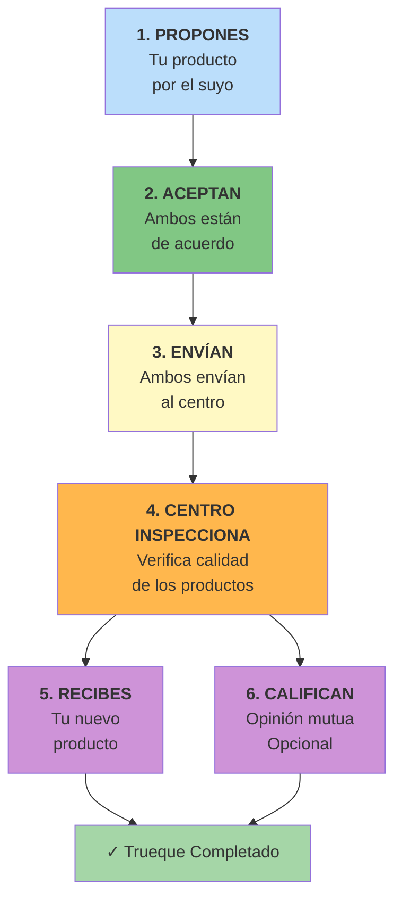

# Guía del Usuario: Sistema de Trueque

## Tabla de Contenidos

- [Introducción](#introducción)
- [Cómo Funciona el Trueque](#cómo-funciona-el-trueque)
- [Paso a Paso para Completar un Trueque](#paso-a-paso-para-completar-un-trueque)
  - [Paso 1: Crear tu Propuesta](#paso-1-crear-tu-propuesta)
  - [Paso 2: Esperar la Respuesta](#paso-2-esperar-la-respuesta)
  - [Paso 3: Enviar tus Productos](#paso-3-enviar-tus-productos)
  - [Paso 4: Inspección de Calidad](#paso-4-inspección-de-calidad)
  - [Paso 5: Recibir tu Producto](#paso-5-recibir-tu-producto)
  - [Paso 6: Calificar la Experiencia](#paso-6-calificar-la-experiencia)
- [Tiempos Estimados](#tiempos-estimados)
- [Consejos para un Trueque Exitoso](#consejos-para-un-trueque-exitoso)
- [Seguridad y Confianza](#seguridad-y-confianza)
- [Preguntas Frecuentes](#preguntas-frecuentes)
- [Solución de Problemas](#solución-de-problemas)
- [Políticas Importantes](#políticas-importantes)

---

## Introducción

Bienvenido al Sistema de Trueque de Mercado Trueque. Nuestra plataforma te permite intercambiar productos de manera segura, justa y transparente con otros usuarios.

### ¿Qué es el Trueque?

El trueque es el intercambio de productos sin usar dinero. En vez de vender tu producto y comprar otro, simplemente intercambias directamente con otro usuario.

**Ejemplo**: Tienes una bicicleta que ya no usas y quieres una patineta. Encuentras a alguien que tiene una patineta y quiere tu bicicleta. ¡Hacen el trueque!

### ¿Por qué usar nuestro sistema?

- **Seguro**: Verificamos la calidad de todos los productos
- **Justo**: Centro de distribución neutral inspecciona todo
- **Transparente**: Seguimiento completo del proceso
- **Sin dinero**: No necesitas pagar, solo intercambiar
- **Confiable**: Sistema de calificaciones garantiza usuarios serios

---

## Cómo Funciona el Trueque

El proceso tiene 6 pasos simples:



### Actores Involucrados

1. **Tú (Usuario)**: Propones o aceptas intercambios
2. **Otro Usuario**: La persona con quien intercambias
3. **Centro de Distribución**: Lugar neutral que inspecciona los productos

---

## Paso a Paso para Completar un Trueque

### Paso 1: Crear tu Propuesta

#### ¿Qué necesitas?

- Tener productos publicados en tu perfil
- Encontrar un producto que te interese de otro usuario
- Decidir qué productos tuyos ofrecer

#### ¿Cómo hacerlo?

1. **Busca el producto que quieres**
   - Navega por el catálogo
   - Filtra por categoría, ubicación, etc.
   - Revisa fotos, descripción y calificación del dueño

2. **Selecciona tus productos a ofrecer**
   - Puedes ofrecer de 1 a 5 productos
   - Solo puedes pedir 1 producto a cambio
   - Asegúrate que sean de valor similar

3. **Escribe un mensaje**
   - Sé amable y claro
   - Explica por qué te interesa el intercambio
   - Menciona si tus productos tienen algún detalle

4. **Envía la propuesta**
   - Haz clic en "Enviar Propuesta"
   - El otro usuario recibirá una notificación

#### Ejemplo de Buen Mensaje

```
¡Hola María!

Me interesa mucho tu patineta eléctrica. Te ofrezco mi bicicleta
de montaña que está en excelente estado, la uso poco porque me
mudé al centro de la ciudad.

La bici tiene pequeños rayones en el marco pero funciona perfecto.
Incluyo casco y candado.

¿Te interesa?

Saludos,
Juan
```

#### ¿Qué pasa después?

- Tu propuesta queda en estado "PENDIENTE"
- Tus productos se reservan (no puedes usarlos en otra propuesta)
- El otro usuario tiene tiempo ilimitado para responder
- Recibirás notificación cuando respondan

---

### Paso 2: Esperar la Respuesta

#### Si ACEPTAN tu propuesta:

1. **Recibes notificación**
   - Email y notificación en la app
   - Se crea un "Intercambio" automáticamente

2. **Se asigna un Centro de Distribución**
   - El sistema elige el centro más cercano
   - Verás la dirección en los detalles del intercambio

3. **Estado cambia a "ACEPTADA"**
   - Ya no puedes cancelar sin acuerdo mutuo
   - Ambos deben proceder con el envío

#### Si RECHAZAN tu propuesta:

- Recibes notificación con la razón (opcional)
- Tus productos quedan disponibles de nuevo
- Puedes hacer otra propuesta al mismo u otro usuario

#### Si recibes una propuesta (tú eres el receptor):

1. **Revisa cuidadosamente**
   - Mira los productos ofrecidos
   - Verifica las fotos y descripciones
   - Revisa la calificación del usuario

2. **Decide si aceptar**
   - ¿Los productos tienen valor similar al tuyo?
   - ¿El usuario tiene buena reputación?
   - ¿Realmente te interesan sus productos?

3. **Acepta o rechaza**
   - Si aceptas, el proceso continúa
   - Si rechazas, envía un mensaje cortés explicando por qué

---

### Paso 3: Enviar tus Productos

#### Preparar el Envío

1. **Empaca bien tus productos**
   - Usa caja resistente
   - Protege con plástico de burbujas
   - Incluye manual/accesorios si aplica

2. **Toma fotos del empaque**
   - Foto del producto antes de empacar
   - Foto del producto empacado
   - Estas fotos te protegen en caso de disputa

#### Registrar el Envío en la Plataforma

1. **Ve a "Mis Intercambios"**
2. **Selecciona el intercambio activo**
3. **Haz clic en "Enviar Productos"**
4. **Llena el formulario**:
   - Dirección de origen (tu dirección)
   - Dirección de destino (se muestra automáticamente: el centro)
   - Notas sobre el envío (opcional)

5. **Confirma el envío**
   - El sistema genera un código de tracking
   - Ejemplo: `TRK-2025-001234`
   - Guarda este código

#### Envío Físico

**Opción A: Envío por Mensajería**
- Contrata servicio de mensajería (InterRapidísimo, Servientrega, etc.)
- Envía al centro de distribución
- Guarda el recibo del envío

**Opción B: Llevar Personalmente**
- Ve al centro de distribución
- Horario: Lunes a Viernes 8am-6pm
- Entrega en recepción con tu código de tracking

#### ¿Quién paga el envío?

- **Tú pagas** el envío de TUS productos al centro
- Costo aproximado: $15,000 - $30,000 COP dependiendo de peso y distancia
- El centro NO cobra por recibir o inspeccionar

#### Estado del Intercambio

- Después de tu envío: "EN_ENVIO"
- Cuando AMBOS envían: Aún "EN_ENVIO"
- Cuando productos llegan al centro: Pasa a "EN_REVISION"

#### ¿Y si el otro usuario no envía?

- Después de 7 días, recibes recordatorio
- Después de 15 días, puedes solicitar cancelación
- Tus productos te serán devueltos
- El otro usuario recibe penalización

---

### Paso 4: Inspección de Calidad

#### ¿Qué pasa en el Centro?

1. **Reciben los productos**
   - Verifican que llegaron completos
   - Actualizan el tracking

2. **Inspeccionan cada producto**
   - Personal capacitado revisa:
     - Estado general
     - Funcionalidad
     - Limpieza
     - Accesorios incluidos
   - Toman fotos de evidencia

3. **Asignan calificación**
   - De 1 a 5 estrellas
   - Escriben observaciones detalladas

#### Criterios de Calificación

| Estrellas | Significado | Resultado |
|-----------|-------------|-----------|
| 5 | Como nuevo, sin defectos | APROBADO |
| 4 | Muy buen estado, detalles mínimos | APROBADO |
| 3 | Buen estado, uso evidente pero funcional | APROBADO |
| 2 | Desgaste considerable | RECHAZADO |
| 1 | Mal estado o no funcional | RECHAZADO |

**Regla**: Calificación de 3 o más = APROBADO

#### Si tus productos son APROBADOS:

- Recibes notificación con la calificación
- El intercambio continúa normalmente
- Los productos se preparan para envío final

#### Si tus productos son RECHAZADOS:

- Recibes notificación con las razones
- Fotos de los problemas encontrados
- El intercambio se CANCELA
- Opciones:
  - Tus productos se devuelven (pagas envío de retorno)
  - Acuerdas con el otro usuario cómo resolver

#### Si los productos del OTRO usuario son rechazados:

- El intercambio se cancela
- Tu producto te será devuelto
- No pierdes nada, solo tiempo
- El otro usuario recibe penalización en reputación

#### Tiempos de Inspección

- Productos simples: 1-2 días hábiles
- Productos electrónicos: 2-3 días hábiles (pruebas más exhaustivas)
- Productos grandes: 3-5 días hábiles

---

### Paso 5: Recibir tu Producto

#### Envío Final

Una vez TODOS los productos están aprobados:

1. **Centro prepara el envío final**
   - Empacan el producto que te corresponde
   - Lo envían a tu dirección

2. **Recibes notificación de envío**
   - Nuevo código de tracking
   - Tiempo estimado de llegada

3. **Llega a tu domicilio**
   - Mensajería toca tu puerta
   - Puedes revisar antes de firmar recibido

#### Confirmar Recepción

**IMPORTANTE**: Debes confirmar en la plataforma

1. **Inspecciona el producto**
   - Revisa que sea el producto correcto
   - Verifica que funcione
   - Compara con las fotos de la publicación

2. **Si todo está bien**:
   - Ve a "Mis Intercambios"
   - Haz clic en "Confirmar Recepción"
   - Ingresa tu dirección de entrega
   - Confirma

3. **Si hay problemas**:
   - NO confirmes recepción
   - Contacta soporte inmediatamente
   - Toma fotos del problema
   - Se abrirá un caso de disputa

#### ¿Cuándo se completa el intercambio?

- Cuando **AMBOS** usuarios confirman recepción
- Estado cambia a "COMPLETADO"
- Ya puedes calificar (Paso 6)

#### Importante

- Tienes 7 días para confirmar recepción
- Si no confirmas en 7 días, se confirma automáticamente
- Una vez confirmado, NO puedes retractarte

---

### Paso 6: Calificar la Experiencia

#### ¿Por qué calificar?

- Ayuda a otros usuarios a decidir
- Construye tu reputación
- Mejora la comunidad
- **Es opcional pero muy recomendado**

#### ¿Qué calificar?

1. **Al Usuario** (1-5 estrellas)
   - Comunicación
   - Responsabilidad
   - Honestidad en la descripción

2. **Al Producto recibido** (1-5 estrellas)
   - Estado vs descripción
   - Funcionalidad
   - Valor percibido

#### Cómo Calificar

1. **Ve al intercambio completado**
2. **Haz clic en "Calificar"**
3. **Llena el formulario**:
   - Estrellas al usuario
   - Estrellas al producto
   - Comentario (opcional pero recomendado)
   - Aspectos positivos
   - Aspectos a mejorar

4. **Envía la calificación**
   - Es permanente, no se puede editar
   - El otro usuario la verá
   - Afecta su promedio de reputación

#### Ejemplo de Buena Calificación

```
Calificación Usuario: 5 estrellas
Calificación Producto: 4 estrellas

Comentario:
"Excelente experiencia con Juan. Muy comunicativo y responsable.
La bicicleta llegó tal como la describió, solo tenía algunos
rayones que él mencionó desde el inicio. Empacó todo muy bien
e incluyó casco y candado. El envío fue rápido.

Aspectos positivos:
- Honesto con la descripción
- Buena comunicación
- Envío rápido
- Producto bien empacado

Aspectos a mejorar:
- Ninguno

Recomendado 100%!"
```

#### ¿Y si la experiencia fue mala?

Sé honesto pero respetuoso:

```
Calificación Usuario: 2 estrellas
Calificación Producto: 2 estrellas

Comentario:
"El producto no coincide con la descripción. Las fotos mostraban
un producto en mejor estado. Comunicación limitada. Tardó mucho
en enviar (15 días después de aceptar).

No recomendaría intercambiar con este usuario."
```

---

## Tiempos Estimados

### Línea de Tiempo Típica

| Fase | Tiempo Estimado | Notas |
|------|-----------------|-------|
| 1. Crear propuesta | 5-10 minutos | Inmediato |
| 2. Esperar respuesta | 1-3 días | Depende del usuario |
| 3. Preparar y enviar | 1 día | Tú controlas esto |
| **Tránsito al centro** | 2-5 días | Según ubicación |
| 4. Inspección | 1-3 días | Según tipo de producto |
| **Tránsito a destino** | 2-5 días | Envío final |
| 5. Confirmar recepción | Inmediato | Tú decides cuándo |
| 6. Calificar | Cuando quieras | Opcional |
| **TOTAL** | **7-15 días hábiles** | Promedio general |

### Factores que Afectan el Tiempo

**Más rápido si:**
- Ambos usuarios son activos y responden rápido
- Viven cerca del centro de distribución
- Productos son simples (ropa, libros, etc.)
- Usan mensajería express

**Más lento si:**
- Usuario tarda en responder/enviar
- Ubicaciones lejanas del centro
- Productos complejos (electrónicos requieren más pruebas)
- Temporada alta (diciembre, etc.)

---

## Consejos para un Trueque Exitoso

### Antes de Proponer

1. **Investiga al usuario**
   - Revisa su calificación promedio
   - Lee sus reseñas anteriores
   - Mira sus otros productos

2. **Sé realista con el valor**
   - Ofrece productos de valor similar
   - No intentes "ganar" el trueque
   - Piensa: ¿yo aceptaría esta oferta?

3. **Describe honestamente**
   - Menciona TODOS los defectos
   - Incluye fotos reales y actuales
   - Si hay detalles, dilo desde el inicio

### Durante el Proceso

4. **Comunícate bien**
   - Responde mensajes pronto
   - Sé amable y profesional
   - Informa si hay retrasos

5. **Empaca con cuidado**
   - Protege bien el producto
   - Usa materiales adecuados
   - Toma fotos del proceso

6. **Envía rápido**
   - No hagas esperar al otro usuario
   - Confirma el envío en la plataforma
   - Guarda comprobantes

### Después del Intercambio

7. **Califica honestamente**
   - Sé justo en tu evaluación
   - Menciona lo bueno y lo malo
   - Ayuda a la comunidad

8. **Mantén tu reputación**
   - Cumple tus compromisos
   - Sé honesto siempre
   - Trata a otros como quieres ser tratado

---

## Seguridad y Confianza

### Cómo te Protegemos

1. **Verificación de Identidad**
   - Todos los usuarios verifican email
   - Sistema de reputación público

2. **Centro de Distribución Neutral**
   - No favorece a ninguna parte
   - Inspección profesional
   - Fotos de evidencia

3. **Proceso Transparente**
   - Seguimiento en tiempo real
   - Historial completo del intercambio
   - Códigos de tracking

4. **Sistema de Calificaciones**
   - Usuarios con mala reputación son limitados
   - Reseñas permanentes
   - Promedio visible para todos

### Qué Hacer y Qué NO Hacer

#### HACER:

- Leer toda la información del producto
- Hacer preguntas antes de proponer
- Ser honesto con tus productos
- Empacar adecuadamente
- Comunicarte claramente
- Calificar después del trueque

#### NO HACER:

- Ocultar defectos de tus productos
- Proponer productos de mucho menor valor
- Cambiar de opinión sin razón válida
- Ignorar mensajes del otro usuario
- Dejar de enviar sin avisar
- Dar información falsa

### Señales de Alerta

**Ten cuidado si el otro usuario:**

- Tiene calificación muy baja (menor a 3 estrellas)
- No tiene reseñas (puede ser nuevo, sé cauteloso)
- Tiene fotos de mala calidad o pocas
- No responde preguntas claramente
- Presiona para hacer el trueque rápido
- Pide contacto fuera de la plataforma

**En estos casos:**
- Haz más preguntas
- Pide fotos adicionales
- Considera proponer a otro usuario

---

## Preguntas Frecuentes

### Sobre Propuestas

**¿Puedo proponer varios productos por varios productos?**
No. Solo puedes ofrecer 1-5 productos por 1 producto solicitado.

**¿Puedo hacer varias propuestas al mismo tiempo?**
Sí, pero tus productos quedan reservados en cada propuesta activa.

**¿Puedo cancelar mi propuesta?**
Sí, mientras esté en estado "PENDIENTE" (antes de ser aceptada).

**¿El otro usuario puede negociar?**
Sí, pueden chatear y llegar a un acuerdo antes de aceptar.

### Sobre Envíos

**¿Quién paga el envío?**
Cada usuario paga el envío de SUS productos al centro. El centro envía gratis a los destinos finales.

**¿Qué pasa si mi paquete se pierde?**
Debes tener seguro con la mensajería. La plataforma no se hace responsable de envíos perdidos.

**¿Puedo usar cualquier mensajería?**
Sí, usa la que prefieras (InterRapidísimo, Servientrega, Coordinadora, etc.).

**¿Cuánto cuesta el envío?**
Depende del peso, tamaño y distancia. Usualmente $15,000 - $30,000 COP.

### Sobre Inspecciones

**¿Qué pasa si no estoy de acuerdo con la calificación?**
Puedes apelar en 48 horas. Soporte revisará el caso con las fotos de evidencia.

**¿Puedo ver las fotos de la inspección?**
Sí, todas las fotos están disponibles en los detalles del intercambio.

**¿Quién hace la inspección?**
Personal capacitado del centro de distribución, neutral a ambas partes.

### Sobre Calificaciones

**¿Puedo cambiar mi calificación?**
No, las calificaciones son permanentes e inmutables.

**¿El otro usuario ve mi calificación?**
Sí, las calificaciones son públicas.

**¿Qué pasa si recibo una calificación injusta?**
Puedes reportarla a soporte. Si es maliciosa, puede ser removida.

### Sobre Cancelaciones

**¿Puedo cancelar después de aceptar?**
Solo con acuerdo mutuo o en casos especiales (productos dañados, etc.).

**¿Qué pasa si me arrepiento?**
Contacta al otro usuario. Si acepta, ambos cancelan. Si no, debes continuar.

**¿Hay penalización por cancelar?**
Depende. Si es con causa justa, no. Si es arbitrario, afecta tu reputación.

### Sobre Problemas

**¿Qué hago si el producto llega dañado?**
NO confirmes recepción. Contacta soporte inmediatamente con fotos.

**¿Y si el producto no es el de las fotos?**
NO confirmes recepción. Abre un caso de disputa con evidencia.

**¿Cuánto tarda soporte en responder?**
24-48 horas hábiles para casos normales. Urgencias se atienden más rápido.

---

## Solución de Problemas

### Problema 1: El otro usuario no responde mi propuesta

**Causas posibles:**
- Está ocupado o de viaje
- No le interesó tu oferta
- No vio la notificación

**Soluciones:**
- Espera 3-5 días
- Envía un mensaje de seguimiento cortés
- Si no responde en 7 días, propón a otro usuario
- Puedes cancelar la propuesta tú mismo

---

### Problema 2: Aceptaron pero no envían

**Causas posibles:**
- Cambió de opinión
- Problemas personales
- Producto ya no disponible

**Soluciones:**
- Envía mensaje preguntando
- Dale tiempo razonable (5-7 días)
- Si no hay respuesta, contacta soporte
- Después de 15 días, puedes solicitar cancelación

---

### Problema 3: Mi producto fue rechazado en inspección

**Causas posibles:**
- No coincide con la descripción
- Estado peor de lo indicado
- No funciona correctamente

**Soluciones:**
- Revisa el reporte detallado
- Mira las fotos de evidencia
- Si no estás de acuerdo, apela en 48 horas
- Si es justo, acepta el rechazo y mejora tu descripción para el futuro

---

### Problema 4: El producto que recibí no es como esperaba

**Causas posibles:**
- Descripción exagerada o engañosa
- Fotos antiguas o editadas
- Daño durante el envío

**Soluciones:**
- NO confirmes recepción
- Toma fotos del problema
- Contacta soporte inmediatamente
- Abre disputa con evidencia
- Se evaluará caso por caso

---

### Problema 5: No puedo confirmar recepción en la plataforma

**Causas posibles:**
- Problema técnico
- Intercambio en estado incorrecto
- Error de conexión

**Soluciones:**
- Refresca la página
- Cierra sesión e inicia de nuevo
- Prueba en otro navegador
- Contacta soporte técnico

---

### Problema 6: Mi calificación es injusta

**Causas posibles:**
- Usuario con expectativas irreales
- Malentendido en la descripción
- Usuario malintencionado

**Soluciones:**
- Responde públicamente a la calificación (función de comentario)
- Reporta a soporte si es maliciosa
- Si hay evidencia de mala fe, puede ser removida
- Aprende de los comentarios constructivos

---

## Políticas Importantes

### Política de Devoluciones

- **No hay devoluciones** una vez confirmada la recepción
- Antes de confirmar, puedes rechazar el producto
- Productos rechazados regresan al dueño (costo de envío a su cargo)

### Política de Cancelaciones

- **Antes de aceptar**: Cancelación libre sin penalización
- **Después de aceptar**: Requiere acuerdo mutuo
- **Cancelación unilateral**: Solo en casos justificados, evaluado por soporte

### Política de Calidad

- Productos deben coincidir con la descripción
- Fotos deben ser reales y actuales
- Todos los defectos deben mencionarse
- Funcionalidad debe ser como se indica

### Política de Conducta

- Trato respetuoso entre usuarios
- Comunicación profesional
- Honestidad en descripciones
- Cumplimiento de compromisos

**Violaciones pueden resultar en:**
- Advertencia
- Suspensión temporal
- Cancelación de cuenta

### Política de Privacidad

- Tu información personal está protegida
- No compartimos datos con terceros
- Comunicación solo a través de la plataforma
- No des tu número/dirección directamente al otro usuario

---

## Recursos Adicionales

### Contacto y Soporte

- **Centro de Ayuda**: https://help.mercado-trueque.com
- **Email**: soporte@mercado-trueque.com
- **Chat en vivo**: Disponible en la plataforma (Lun-Vie 8am-6pm)
- **WhatsApp**: +57 300 123 4567 (solo urgencias)

### Tutoriales en Video

- **Cómo crear tu primera propuesta**: [Ver video]
- **Cómo empacar productos correctamente**: [Ver video]
- **Qué hacer cuando recibes tu producto**: [Ver video]
- **Cómo calificar efectivamente**: [Ver video]

### Documentación Técnica

- [Guía Completa de Fases](./FASES_TRUEQUE.md) - Documentación detallada
- [Referencia de API](./TRUEQUE_API_REFERENCE.md) - Para desarrolladores

### Comunidad

- **Foro**: https://foro.mercado-trueque.com
- **Blog**: https://blog.mercado-trueque.com
- **Redes Sociales**: @mercadotrueque (Instagram, Twitter, Facebook)

---

## Consejos Finales

### Para Tener Éxito

1. **Paciencia**: Los buenos trueques toman tiempo
2. **Honestidad**: Siempre es la mejor política
3. **Comunicación**: Mantén informado al otro usuario
4. **Calidad**: Ofrece productos en buen estado
5. **Respeto**: Trata a otros como quieres ser tratado

### Recuerda

- El trueque es un acuerdo entre personas
- Todos ganan cuando ambos están satisfechos
- Tu reputación es tu activo más valioso
- La plataforma está para facilitar, no para forzar
- Si algo no se siente bien, no lo hagas

### Mantente Seguro

- Nunca des información bancaria
- No hagas tratos fuera de la plataforma
- No envíes productos sin registrar en el sistema
- No compartas información personal sensible
- Confía en el proceso, fue diseñado para protegerte

---

**Bienvenido a la comunidad de Mercado Trueque. ¡Feliz intercambio!**

---

**Versión**: 1.0
**Última Actualización**: 2025-11-19
**¿Preguntas?** Contacta soporte@mercado-trueque.com
