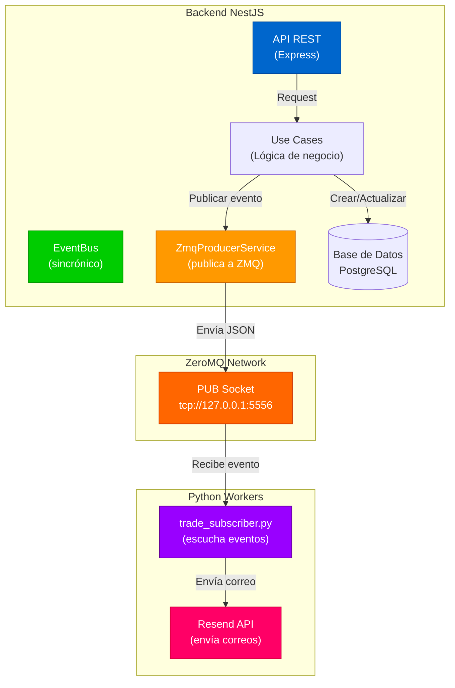
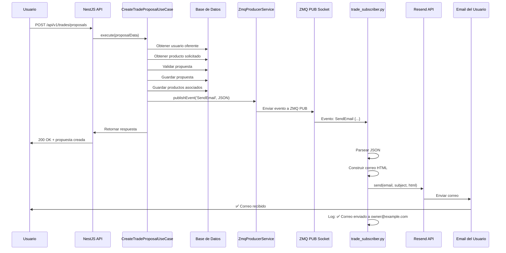
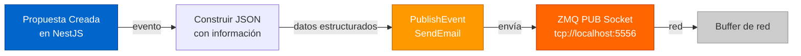
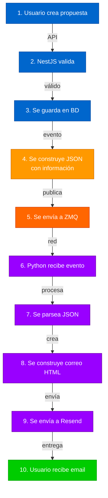
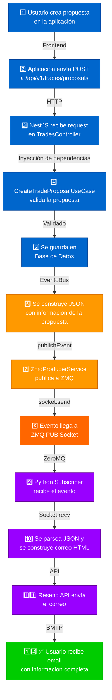
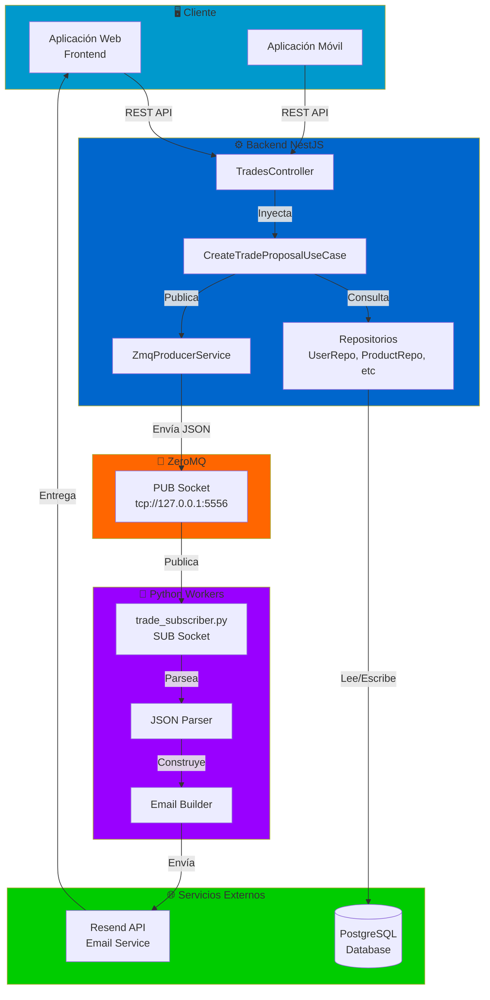

# Sistema de Eventos ZMQ - Mercado Trueque

## 📋 Tabla de Contenidos

1. [Arquitectura General](#arquitectura-general)
2. [Flujo de Propuestas](#flujo-de-propuestas)
3. [Comunicación entre Servicios](#comunicación-entre-servicios)
4. [Estructura de Eventos](#estructura-de-eventos)
5. [Ejemplos de Uso](#ejemplos-de-uso)

---

## 🏗️ Arquitectura General



---

## 🔄 Flujo de Propuestas

### Vista Completa



---

## 📡 Comunicación entre Servicios

### 1. NestJS → ZMQ



### 2. ZMQ → Python

```mermaid
graph LR
    A["ZMQ PUB Socket<br/>tcp://localhost:5556"]
    B["Recibe evento<br/>SendEmail"]
    C["Parsea JSON"]
    D["Extrae información"]
    E["Construye correo HTML"]
    F["Envía a Resend API"]
    G["Usuario recibe email"]

    A -->|evento| B
    B -->|parse| C
    C -->|extrae| D
    D -->|construye| E
    E -->|envía| F
    F -->|entrega| G

    style A fill:#ff6600,stroke:#cc3300,color:#fff
    style B fill:#9900ff,stroke:#660099,color:#fff
    style F fill:#ff0066,stroke:#cc0033,color:#fff
    style G fill:#00cc00,stroke:#009900,color:#fff
```



---

## 📦 Estructura de Eventos

### Evento: SendEmail (Propuesta Creada)

```json
{
  "ownerEmail": "propietario@example.com",
  "ownerName": "Juan García López",
  "oferentEmail": "oferente@example.com",
  "oferentName": "María López Pérez",
  "proposalId": "550e8400-e29b-41d4-a716-446655440000",
  "proposalMessage": "Me encanta tu LG, te ofrezco mi Samsung",
  "requestedProductTitle": "LG 55 pulgadas OLED 2024",
  "requestedProductId": "123e4567-e89b-12d3-a456-426614174000",
  "timestamp": "2025-11-25T03:00:00.000Z"
}
```

### Flujo del Evento en el Sistema



---

## 💻 Ejemplos de Uso

### Ejemplo 1: Crear una Propuesta

**Request:**
```bash
curl -X POST http://localhost:3000/api/v1/trades/proposals \
  -H "Content-Type: application/json" \
  -H "Authorization: Bearer eyJhbGc..." \
  -d '{
    "usuario_oferente_id": "5fc67613-13ec-48b9-8269-4bbc2ded9ee4",
    "requested_product_id": "ea42f01e-0dc4-4df6-a401-86388255edcd",
    "offered_product_ids": ["3c5f8e2a-1b9c-4d6e-9f2a-8b3c5e7a9f1d"],
    "message": "Quiero tu LG, te ofrezco mi Samsung"
  }'
```

**Response:**
```json
{
  "id": "550e8400-e29b-41d4-a716-446655440000",
  "usuario_oferente_id": "5fc67613-13ec-48b9-8269-4bbc2ded9ee4",
  "producto_solicitado_id": "ea42f01e-0dc4-4df6-a401-86388255edcd",
  "estado": "pendiente",
  "mensaje": "Quiero tu LG, te ofrezco mi Samsung",
  "fecha_propuesta": "2025-11-25T03:00:00.631Z",
  "fecha_respuesta": null
}
```

### Ejemplo 2: Evento Publicado a ZMQ

**En NestJS (logs):**
```
[NestJS] LOG [CreateTradeProposalUseCase] ✅ Evento ZMQ publicado: ProposalCreated para propietario@example.com
```

**Evento enviado a ZMQ:**
```
SendEmail {"ownerEmail":"propietario@example.com","ownerName":"Juan García","oferentEmail":"maria@example.com","oferentName":"María López","proposalId":"550e8400-e29b-41d4-a716-446655440000","proposalMessage":"Quiero tu LG","requestedProductTitle":"LG 55 pulgadas","requestedProductId":"ea42f01e-0dc4-4df6-a401-86388255edcd","timestamp":"2025-11-25T03:00:00.000Z"}
```

### Ejemplo 3: Python Recibe y Procesa

**En Python (logs):**
```
[2025-11-25 03:00:00] 📥 Evento recibido: SendEmail {"ownerEmail":"propietario@example.com"...}
✅ Correo enviado a ['propietario@example.com']
```

---

## 🔌 Endpoints y Eventos

### NestJS Endpoints

| Método | Endpoint | Descripción | Genera Evento |
|--------|----------|-------------|---------------|
| POST | `/api/v1/trades/proposals` | Crear propuesta | ✅ SendEmail |
| PUT | `/api/v1/trades/proposals/:id/accept` | Aceptar propuesta | ✅ SendEmail |
| PUT | `/api/v1/trades/proposals/:id/reject` | Rechazar propuesta | ✅ SendEmail |
| POST | `/api/v1/trades/:id/ship` | Enviar productos | ✅ SendEmail |
| PUT | `/api/v1/trades/:id/deliver` | Entregar productos | ✅ SendEmail |
| POST | `/api/v1/trades/:id/rate` | Calificar intercambio | ✅ SendEmail |

### Eventos ZMQ

| Tipo | Estructura | Destino |
|------|-----------|---------|
| `SendEmail` | JSON con información | trade_subscriber.py → Resend |
| (Future) `SendSMS` | JSON con teléfono | Python SMS Worker |
| (Future) `SendPushNotification` | JSON con datos | Python Push Worker |

---

## 🔐 Variables de Entorno

### NestJS Backend (.env)

```env
# ZeroMQ Configuration
ZMQ_URL=tcp://127.0.0.1:5556
```

### Python Subscriber (.env)

```env
# ZeroMQ Configuration
ZMQ_URL=tcp://localhost:5556

# Resend Email Configuration
RESEND_API_KEY=re_xxxxxxxxxxxxxxxxxxxxxxxx
FROM_EMAIL=noreply@mercado-trueque.com
```

---

## 🚀 Flujo Completo Paso a Paso



---

## 📊 Diagrama de Componentes



---

## ⏱️ Timeline de una Propuesta

```mermaid
timeline
    title Línea de Tiempo: Crear Propuesta → Recibir Email

    section NestJS
    00:00 : Usuario crea propuesta en app
    00:01 : API recibe POST request
    00:02 : UseCase valida datos
    00:03 : Se guarda en BD
    00:04 : Se construye JSON del evento
    00:05 : ZmqProducerService publica

    section ZeroMQ
    00:06 : Evento llega a PUB Socket
    00:07 : Se propaga por la red

    section Python
    00:08 : trade_subscriber recibe
    00:09 : Parsea JSON
    00:10 : Construye email HTML
    00:11 : Envía a Resend API

    section Email
    00:12 : Resend procesa email
    00:13 : Email service envía
    00:14 : ✅ Usuario recibe email
```

---

## 🔍 Debugging y Monitoreo

### Ver eventos en NestJS

```bash
# Terminal 1: Iniciar servidor
pnpm run start:dev

# Buscar en logs:
# ✅ Evento ZMQ publicado: ProposalCreated para propietario@example.com
```

### Ver eventos en Python

```bash
# Terminal 2: Iniciar subscriber
python trade_subscriber.py

# Debería mostrar:
# [2025-11-25 03:00:00] 📥 Evento recibido: SendEmail {...}
# ✅ Correo enviado a ['propietario@example.com']
```

### Verificar Resend

```bash
# Ve a https://resend.com/emails
# Verifica que el correo aparece en el dashboard
```

---

## 🎯 Próximos Pasos

### Phase 2: Otros Eventos

- ✅ `ProposalCreated` - Implementado
- ⏳ `ProposalAccepted` - Por implementar
- ⏳ `ProposalRejected` - Por implementar
- ⏳ `ProductsShipped` - Por implementar
- ⏳ `TradeDelivered` - Por implementar
- ⏳ `TradeRated` - Por implementar

### Phase 3: Otros Canales

- 📧 Email via Resend - ✅ Implementado
- 📱 SMS via Twilio - ⏳ Por implementar
- 🔔 Push Notifications - ⏳ Por implementar

---

## 📚 Referencias

- [ZeroMQ Documentation](https://zeromq.org/)
- [NestJS Documentation](https://docs.nestjs.com/)
- [Resend Documentation](https://resend.com/docs)
- [Mermaid Diagrams](https://mermaid.js.org/)

---

**Última actualización:** 2025-11-25
**Versión:** 1.0.0
